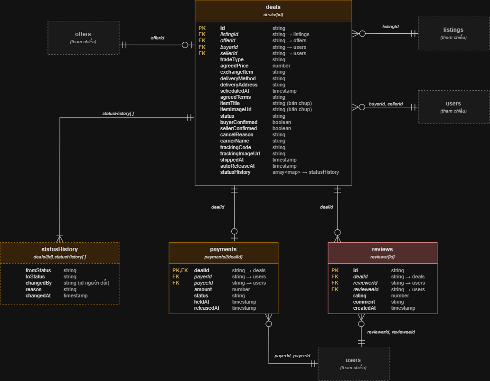
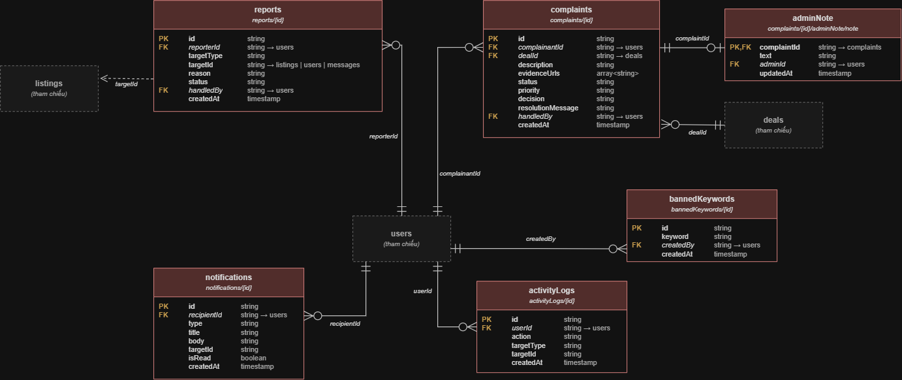
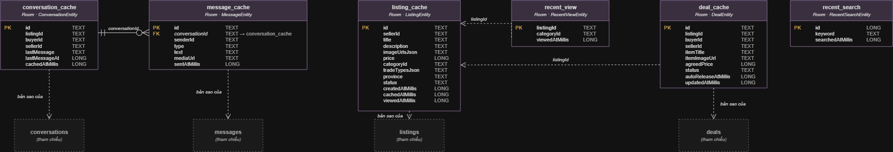

# Sơ đồ quan hệ thực thể (ERD)

Mô hình dữ liệu cho Cloud Firestore và Room (SQLite cục bộ), khớp với các lớp trong `diagrams/so-do-lop/`.

Nộp vào đây:

- `erd.drawio`: file gốc nhiều trang, mở bằng draw.io.
- Ảnh `.png` xuất ra của từng trang.
- Nội dung README này được thay bằng bản tóm tắt đầy đủ: danh sách collection Firestore, bảng Room, quan hệ giữa chúng.

Cập nhật bảng dưới đây khi nộp:

| Mục | Số lượng |
| --- | --- |
| Collection Firestore | |
| Bảng Room | |

## Trang 3 đến 5

Ảnh xuất từ draw.io của trang 3, 4, 5. Hộp viền nét đứt ghi "(tham chiếu)" là collection của trang khác.

### Trang 3. Giao dịch, thanh toán, đánh giá (Firestore)

| Collection | Đường dẫn |
| --- | --- |
| `deals` | `deals/{id}` |
| `statusHistory` | `deals/{id}.statusHistory[ ]` |
| `payments` | `payments/{dealId}` |
| `reviews` | `reviews/{id}` |

| Quan hệ | Trường |
| --- | --- |
| `offers` 1 - 0..1 `deals` | `offerId` |
| `listings` 1 - 0..n `deals` | `listingId` |
| `users` 1 - 0..n `deals` | `buyerId`, `sellerId` |
| `deals` 1 - 1..n `statusHistory` | `statusHistory[ ]` |
| `deals` 1 - 0..1 `payments` | `dealId` |
| `deals` 1 - 0..n `reviews` | `dealId` |
| `users` 1 - 0..n `payments` | `payerId`, `payeeId` |
| `users` 1 - 0..n `reviews` | `reviewerId`, `revieweeId` |

### Trang 4. Tin cậy, quản trị (Firestore)

| Collection | Đường dẫn |
| --- | --- |
| `reports` | `reports/{id}` |
| `complaints` | `complaints/{id}` |
| `adminNote` | `complaints/{id}/adminNote/note` |
| `bannedKeywords` | `bannedKeywords/{id}` |
| `notifications` | `notifications/{id}` |
| `activityLogs` | `activityLogs/{id}` |

| Quan hệ | Trường |
| --- | --- |
| `users` 1 - 0..n `reports` | `reporterId` |
| `reports` tham chiếu `listings` (nét đứt) | `targetId` |
| `users` 1 - 0..n `complaints` | `complainantId` |
| `complaints` 1 - 0..1 `adminNote` | `complaintId` |
| `deals` 1 - 0..n `complaints` | `dealId` |
| `users` 1 - 0..n `bannedKeywords` | `createdBy` |
| `users` 1 - 0..n `notifications` | `recipientId` |
| `users` 1 - 0..n `activityLogs` | `userId` |

### Trang 5. Room (SQLite)

| Bảng | Entity |
| --- | --- |
| `conversation_cache` | `ConversationEntity` |
| `message_cache` | `MessageEntity` |
| `listing_cache` | `ListingEntity` |
| `recent_view` | `RecentViewEntity` |
| `deal_cache` | `DealEntity` |
| `recent_search` | `RecentSearchEntity` |

| Quan hệ | Trường |
| --- | --- |
| `conversation_cache` 1 - 0..n `message_cache` | `conversationId` |
| `recent_view` tham chiếu `listing_cache` (nét đứt) | `listingId` |
| `deal_cache` tham chiếu `listing_cache` (nét đứt) | `listingId` |
| `conversation_cache` bản sao của `conversations` | |
| `message_cache` bản sao của `messages` | |
| `listing_cache` bản sao của `listings` | |
| `deal_cache` bản sao của `deals` | |
