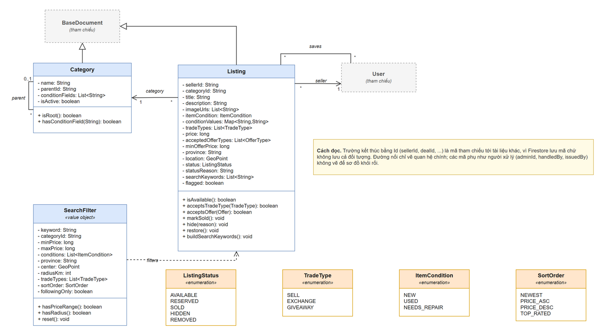
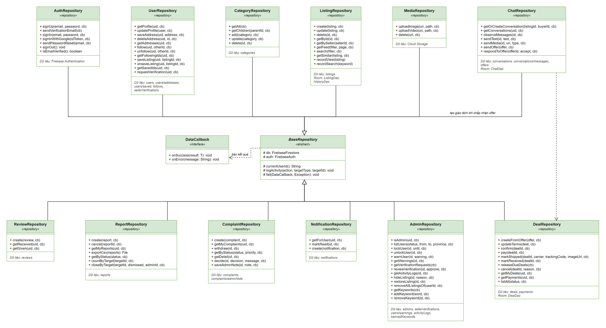
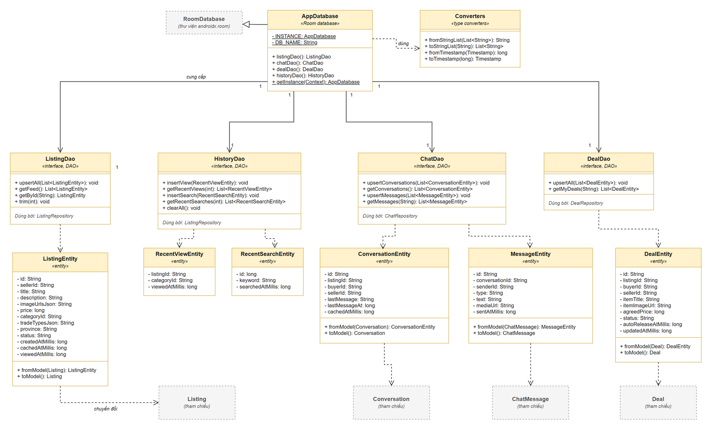
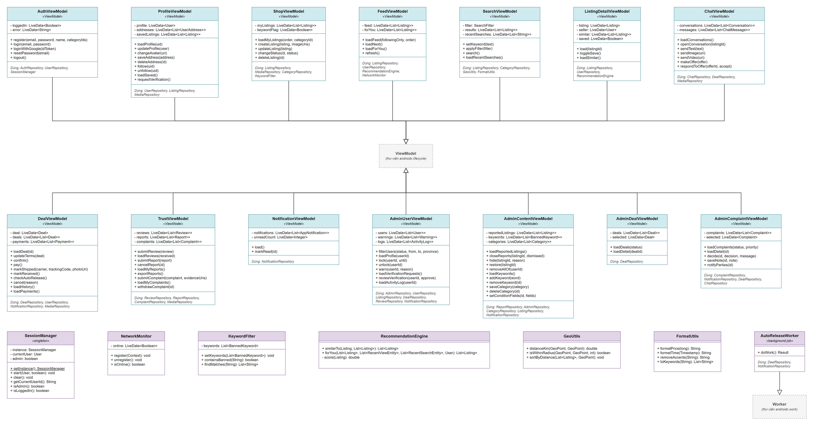

# Sơ đồ lớp

## 1. Kiến trúc MVVM kết hợp Repository

Sơ đồ thể hiện 85 lớp và giao diện, được tổ chức theo kiến trúc **MVVM (Model-View-ViewModel)** kết hợp mẫu thiết kế **Repository**. Đây là kiến trúc được chọn để đáp ứng hai yêu cầu chính của môn học: chia tách logic nghiệp vụ khỏi giao diện, và có khả năng hoạt động offline.

Ba tầng chính của ứng dụng:

- **Tầng View (Activity/Fragment):** Không có mặt trong sơ đồ này. Lý do: đây là sơ đồ lớp phân tích miền dữ liệu và nghiệp vụ, tập trung vào cách tổ chức logic.
- **Tầng ViewModel:** Đóng vai trò cầu nối. Chứa 12 lớp (như `AuthViewModel`, `ListingViewModel`, `ChatViewModel`). Các lớp này giữ trạng thái cho giao diện, gọi hàm từ Repository, và không trực tiếp truy cập cơ sở dữ liệu.
- **Tầng Data (Repository, Model, Local):** Là phần cốt lõi của sơ đồ, chứa 73 lớp.
  - **Repository (12 lớp):** Ẩn chi tiết lưu trữ (như `AuthRepository`, `ListingRepository`). Tầng ViewModel chỉ biết Repository, không biết Firebase hay Room. Tất cả đều kế thừa `BaseRepository`.
  - **Local (6 lớp):** Chịu trách nhiệm bộ nhớ đệm ngoại tuyến bằng Room SQLite (yêu cầu môn học), bao gồm `AppDatabase`, `ListingDao`, `ChatDao` và các Entity tương ứng. `NetworkMonitor` quyết định lúc nào dùng Local.
  - **Model:** Chứa 17 lớp tài liệu chính (thực thể Firestore) và 20 kiểu liệt kê (Enum).

## 2. Mô hình miền và kiểu liệt kê

**Nhóm lớp mô hình miền (Document/Entity):**
Gồm 17 lớp đại diện cho các thực thể lưu trong Cloud Firestore. Tất cả đều kế thừa lớp trừu tượng `BaseDocument` chứa hai thuộc tính chung `id` (mã tự sinh) và `createdAt`/`updatedAt` (thời điểm). Ví dụ: `User`, `Listing`, `Deal`, `Message`, `Complaint`.

**Nhóm kiểu liệt kê (Enum):**
Ứng dụng sử dụng 20 kiểu liệt kê để giới hạn giá trị của các trạng thái và loại dữ liệu, tránh sai sót khi nhập chuỗi thủ công. Nhóm này rất đa dạng, phản ánh tính chất nghiệp vụ phức tạp của một sàn giao dịch kết hợp mạng xã hội:
- **Trạng thái thực thể:** `UserStatus`, `ListingStatus`, `DealStatus`, `PaymentStatus`, `ReportStatus`, `ComplaintStatus`.
- **Hành vi và hình thức:** `TransactionType` (Bán, Trao đổi, Cho/Tặng), `TargetRole` (Mua, Bán), `ActivityType` (nhật ký hoạt động).
- **Phân loại khác:** `TargetType`, `ReportTarget`, `Priority`, `ComplaintDecision`.

### Truy cập dữ liệu (trang 5): 14 lớp

| Lớp | Vai trò |
| --- | --- |
| `DataCallback` | Giao diện gọi lại chung: repository báo kết quả hoặc lỗi cho ViewModel. |
| `BaseRepository` | Lớp cha của mọi repository: giữ kết nối Firebase, ghi nhật ký, xử lý lỗi chung. |
| `AuthRepository` | Đăng ký, đăng nhập, quên mật khẩu, xác thực email. |
| `UserRepository` | Hồ sơ, địa chỉ, theo dõi, lưu tin, yêu cầu xác minh. |
| `CategoryRepository` | Danh mục và danh mục con; admin thêm, sửa, xóa. |
| `ListingRepository` | Tin đăng, tìm kiếm, kênh xem; đọc bộ nhớ đệm trước rồi mới gọi mạng. |
| `MediaRepository` | Tải ảnh và video lên Cloud Storage. |
| `ChatRepository` | Chat theo thời gian thực và offer một chạm. |
| `DealRepository` | Vòng đời giao dịch và ký quỹ; giải ngân khi người mua nhận hàng hoặc khi hết thời hạn đếm ngược. |
| `ReviewRepository` | Đánh giá và cập nhật điểm trung bình của người được đánh giá. |
| `ReportRepository` | Báo cáo vi phạm; người dùng xem, hủy và xuất lịch sử. |
| `ComplaintRepository` | Khiếu nại; ghi chú nội bộ nằm ở tài liệu con chỉ admin đọc được. |
| `NotificationRepository` | Thông báo cho từng người dùng. |
| `AdminRepository` | Thao tác dành riêng cho admin: người dùng, xác minh, kiểm duyệt, từ khóa cấm. |

### Lưu trữ cục bộ Room (trang 6): 12 lớp

| Lớp | Vai trò |
| --- | --- |
| `AppDatabase` | Cơ sở dữ liệu SQLite cục bộ; bị xóa sạch khi đăng xuất. |
| `Converters` | Đổi kiểu danh sách và thời gian sang kiểu SQLite lưu được. |
| `ListingEntity` | Bản sao tin đăng đã xem hoặc trong bảng tin để xem lại khi mất mạng. |
| `ConversationEntity` | Bản sao danh sách cuộc trò chuyện. |
| `MessageEntity` | Bản sao tin nhắn đã xem. |
| `DealEntity` | Bản sao lịch sử giao dịch của người dùng. |
| `RecentViewEntity` | Lịch sử xem tin, nguồn của mục Dành cho bạn; chỉ nằm trên máy. |
| `RecentSearchEntity` | Lịch sử tìm kiếm, nguồn của mục Dành cho bạn; chỉ nằm trên máy. |
| `ListingDao` | Truy vấn bảng listing_cache. |
| `ChatDao` | Truy vấn conversation_cache và message_cache. |
| `DealDao` | Truy vấn deal_cache. |
| `HistoryDao` | Truy vấn recent_view và recent_search. |

### Tiện ích (trang 7): 7 lớp

| Lớp | Vai trò |
| --- | --- |
| `SessionManager` | Giữ người dùng đang đăng nhập và cờ admin cho toàn ứng dụng. |
| `NetworkMonitor` | Theo dõi kết nối mạng để chọn dữ liệu cục bộ hay dữ liệu mạng. |
| `KeywordFilter` | So khớp chuỗi với từ khóa cấm để gắn cờ tin đăng. |
| `RecommendationEngine` | Chấm điểm trên máy để gợi ý sản phẩm tương tự và mục Dành cho bạn. |
| `GeoUtils` | Tính khoảng cách và lọc theo bán kính (Firestore không truy vấn được theo bán kính). |
| `FormatUtils` | Định dạng giá, thời gian; bỏ dấu tiếng Việt để tìm kiếm. |
| `AutoReleaseWorker` | Việc chạy nền định kỳ trên máy: tự giải ngân các giao dịch đã hết hạn đếm ngược. |

### ViewModel (trang 7): 14 lớp

| Lớp | Vai trò |
| --- | --- |
| `AuthViewModel` | Đăng ký, đăng nhập, quên mật khẩu, chọn danh mục quan tâm. |
| `ProfileViewModel` | Hồ sơ, ảnh, địa chỉ, theo dõi, danh sách đã lưu, yêu cầu xác minh. |
| `ShopViewModel` | Kệ hàng của người bán: đăng, sửa, đổi trạng thái, sắp xếp. |
| `FeedViewModel` | Kênh chung, kênh đang theo dõi, sắp xếp, mục Dành cho bạn. |
| `SearchViewModel` | Từ khóa, bộ lọc và lịch sử tìm kiếm. |
| `ListingDetailViewModel` | Chi tiết tin, người bán, tin tương tự, lưu tin. |
| `ChatViewModel` | Danh sách chat, gửi chữ, ảnh, video và offer. |
| `DealViewModel` | Tạo, sửa, xác nhận, thanh toán, giao (kèm vận đơn), nhận, hủy, đếm ngược và lịch sử giao dịch. |
| `TrustViewModel` | Đánh giá, báo cáo và khiếu nại phía người dùng. |
| `NotificationViewModel` | Danh sách thông báo và số chưa đọc. |
| `AdminUserViewModel` | Admin: người dùng, hồ sơ, khóa, cảnh báo, xác minh, nhật ký. |
| `AdminContentViewModel` | Admin: tin bị báo cáo, ẩn và gỡ, từ khóa cấm, danh mục. |
| `AdminDealViewModel` | Admin: theo dõi danh sách và chi tiết giao dịch. |
| `AdminComplaintViewModel` | Admin: xử lý khiếu nại, ra quyết định, ghi chú nội bộ, thông báo. |

## 3. Thể hiện OOP

Sơ đồ tuân thủ chặt chẽ 4 tính chất của Lập trình Hướng đối tượng:

- **Đóng gói (Encapsulation):** Mọi thuộc tính của các lớp tài liệu đều để private (dấu `-`), truy cập qua getter/setter (không vẽ getter/setter để tránh rối sơ đồ, luật mặc định). Repository đóng gói logic mạng.
- **Kế thừa (Inheritance):** Thể hiện rõ nhất ở lớp `BaseDocument` (mũi tên rỗng). 17 lớp thực thể đều kế thừa `BaseDocument`. `BaseRepository` là lớp cha của 12 repository, chứa các hàm dùng chung như ghi log hoạt động.
- **Đa hình (Polymorphism):** Giao diện `DataCallback<T>` được cài đặt (implement) theo nhiều kiểu khác nhau trong các ViewModel để nhận kết quả từ Repository, thay thế cho lambda expression theo đúng luật viết mã của nhóm.
- **Trừu tượng (Abstraction):** Tầng ViewModel chỉ giao tiếp với Repository qua các hàm trừu tượng (như `loadListings()`, `submitReport()`), không biết bên dưới lấy dữ liệu từ Firebase hay Room.

## 4. Các trang sơ đồ

### Trang 0: Tổng quan và chú giải

### Trang 1: Người dùng, danh mục và tin đăng

### Trang 2: Nhắn tin, đề nghị và tìm kiếm

### Trang 3: Trao đổi, thanh toán và đánh giá

### Trang 4: Độ tin cậy và quản trị (Admin)

### Trang 5: Truy cập dữ liệu (Repository)

### Trang 6: Lưu trữ cục bộ Room (Local)

### Trang 7: ViewModel và Tiện ích

## 5. Luồng hoạt động chính

**Đăng tin và tìm kiếm.** `ShopViewModel` tạo `Listing`, `KeywordFilter` gắn cờ nếu chứa từ khóa cấm, `MediaRepository` tải ảnh, `ListingRepository` ghi Firestore. Người mua tìm bằng `SearchFilter`; Firestore không tìm toàn văn nên từ khóa được bỏ dấu và lưu trong `searchKeywords`, còn bán kính do `GeoUtils` tính trên máy.

**Offer và giao dịch.** Người mua gửi `Offer` trong `Conversation`; người bán chấp nhận thì `DealRepository.createFromOffer` tạo `Deal`. `Deal` đi qua các trạng thái `PENDING_CONFIRM, CONFIRMED, SHIPPED, COMPLETED` (hoặc `CANCELLED, DISPUTED`), mỗi lần chuyển ghi một `StatusChange`.

**Gửi hàng kèm bằng chứng vận đơn.** Người bán muốn xác nhận đã gửi phải chụp ảnh mã vận đơn và điền tên đơn vị vận chuyển (bên thứ ba) cùng mã vận đơn: `DealViewModel.markShipped(carrier, trackingCode, photoUri)` tải ảnh lên qua `MediaRepository`, rồi `DealRepository.markShipped` ghi `carrierName`, `trackingCode`, `trackingImageUrl` và đặt `shippedAt`. Thiếu một trong ba thứ thì `Deal.hasShippingProof()` sai và giao dịch không sang `SHIPPED`. Cùng lúc `autoReleaseAt = shippedAt + AUTO_RELEASE_DAYS` được đặt: đó là mốc bắt đầu đếm ngược mà màn hình hiển thị cho cả hai bên.

**Thanh toán ký quỹ mô phỏng và giải ngân tự động.** Khi giao dịch được xác nhận, `Payment` ở trạng thái `HELD`. Có hai đường tới `RELEASED`, đều tự động, admin không duyệt tay:

1. Người mua bấm đã nhận hàng: `DealRepository.markReceived` ghi trong một lần cả `Deal` sang `COMPLETED` và `Payment` sang `RELEASED`.
2. **Hết thời hạn đếm ngược** mà người mua chưa xác nhận: `DealRepository.releaseDueDeals` tìm các giao dịch `SHIPPED` có `autoReleaseAt` đã qua, gọi `Deal.autoComplete()` (ghi `StatusChange` với lý do tự động hoàn tất) và chuyển `Payment` sang `RELEASED`, rồi gửi thông báo cho hai bên.

Hủy trước khi giao hoặc quyết định khiếu nại hoàn tiền thì `Payment` sang `REFUNDED`. Nếu người mua mở khiếu nại trước khi hết hạn, giao dịch sang `DISPUTED` và **đếm ngược dừng** (`Deal.isAutoReleaseDue` chỉ đúng khi trạng thái còn là `SHIPPED`). Đây là mô phỏng, không có cổng thanh toán thật.

**Vì sao có lớp `AutoReleaseWorker`.** Đồ án không có máy chủ nên không có ai chạy lệnh đúng lúc hết hạn. `AutoReleaseWorker` (WorkManager, chạy nền định kỳ trên máy) và bước kiểm tra mỗi khi mở ứng dụng (`DealViewModel.checkAutoRelease`) cùng gọi `releaseDueDeals`. Việc chuyển tiền được **Security Rules chặn ở phía máy chủ**: chỉ cho `RELEASED` khi `request.time` (giờ của Firestore) đã qua `autoReleaseAt` và giao dịch còn `SHIPPED`, nên máy khách không tự rút tiền sớm được. **Giới hạn:** nếu không máy nào của hai bên chạy, việc giải ngân chậm cho tới lần mở ứng dụng kế tiếp. Cách chuẩn hơn là Cloud Functions theo lịch (ngoài stack Java, cần gói Blaze).
Thời hạn `AUTO_RELEASE_DAYS` là hằng số trong `Deal` (nhóm tự chọn số ngày, ví dụ 3 đến 7). Cấu hình thời hạn theo vận hành (dòng 89) vẫn thuộc nhóm tô đỏ, chưa làm.

**Tin cậy.** Sau giao dịch mỗi bên đánh giá một lần (`Review`, tối đa 2 mỗi giao dịch). Báo cáo (`Report`) nhắm vào tin, người hoặc tin nhắn; khiếu nại (`Complaint`) có bằng chứng, mức ưu tiên và quyết định của admin; ghi chú nội bộ `adminNote` nằm ở tài liệu con để người dùng không đọc được.

**Cảnh báo 3 bậc.** `Warning.resultingStatus` cho bậc 1 chỉ cảnh báo, bậc 2 khóa tạm, bậc 3 khóa vĩnh viễn.

**Quản trị.** Admin là người dùng có tài liệu trong `admins/{uid}` (do leader tạo); Security Rules kiểm tra tài liệu này, ứng dụng không tự khai quyền. Mọi admin có cùng quyền (phân vai trò thuộc nhóm tô đỏ).

## 6. Thống kê số lượng lớp

| Gói | Số lượng lớp / giao diện |
| --- | --- |
| `model` | 20 |
| `model.enums` | 18 |
| `data` | 14 |
| `data.local` | 12 |
| `util` | 7 |
| `viewmodel` | 14 |
| **Tổng** | **85** |

## 7. Bảng truy vết: dòng chức năng tới lớp

Mỗi dòng chức năng không tô đỏ có ít nhất một lớp hoặc thành viên đáp ứng; mỗi lớp trỏ về ít nhất một dòng hoặc thuộc nhóm hạ tầng ở mục 8.

| Dòng | Chức năng | Lớp và thành viên |
| --- | --- | --- |
| 3, 4, 5 | Đăng ký, đăng nhập, quên mật khẩu (kèm xác thực email và Google) | `AuthViewModel.register`, `AuthViewModel.login`, `AuthViewModel.loginWithGoogle`, `AuthViewModel.resetPassword`, `AuthRepository.signUp`, `AuthRepository.sendVerificationEmail`, `AuthRepository.signIn`, `AuthRepository.signInWithGoogle`, `AuthRepository.sendPasswordReset`, `SessionManager`, `User` |
| 6 | Chỉnh sửa thông tin cá nhân | `ProfileViewModel.updateProfile`, `UserRepository.updateProfile`, `User` |
| 7 | Chỉnh sửa ảnh hồ sơ | `ProfileViewModel.changeAvatar`, `MediaRepository.uploadImage`, `User.avatarUrl` |
| 8 | Chỉnh sửa địa chỉ | `ProfileViewModel.saveAddress`, `ProfileViewModel.deleteAddress`, `UserRepository.saveAddress`, `UserRepository.deleteAddress`, `UserAddress` |
| 9 | Xem đánh giá cá nhân công khai | `User.ratingAverage`, `User.ratingCount`, `ProfileViewModel.loadProfile`, `ReviewRepository.create` |
| 10 | Quản lý kệ hàng: CRUD tin và trạng thái | `ShopViewModel.createListing`, `ShopViewModel.updateListing`, `ShopViewModel.changeStatus`, `ShopViewModel.deleteListing`, `ListingRepository.create`, `ListingRepository.update`, `ListingRepository.delete`, `Listing.markSold`, `ListingStatus` |
| 11 | Sắp xếp sản phẩm trên kệ theo danh mục, thời gian | `ShopViewModel.loadMyListings`, `ListingRepository.getBySeller`, `SortOrder` |
| 12 | Chỉnh sửa nội dung bài đăng | `Listing.description`, `Listing.itemCondition`, `Listing.conditionValues`, `ItemCondition` |
| 13 | Thêm hình ảnh chụp từ phần mềm | `Listing.imageUrls`, `MediaRepository.uploadImage`, `ShopViewModel.createListing` |
| 14 | Hình thức giao dịch bán, trao đổi, cho tặng (kết hợp được) | `Listing.tradeTypes`, `Listing.acceptsTradeType`, `TradeType` |
| 15 | Chỉnh sửa giá cả | `Listing.price` |
| 16 | Offer mong muốn và giới hạn mức deal | `Listing.acceptedOfferTypes`, `Listing.minOfferPrice`, `Listing.acceptsOffer`, `OfferType` |
| 17 | Chọn danh mục cho món đồ | `Listing.categoryId`, `Category`, `CategoryRepository.getAll` |
| 18 | Tìm kiếm theo từ khóa | `SearchViewModel.setKeyword`, `SearchViewModel.search`, `ListingRepository.search`, `Listing.searchKeywords`, `Listing.buildSearchKeywords`, `FormatUtils.removeAccents`, `FormatUtils.toKeywords`, `SearchFilter.keyword` |
| 19 | Lọc theo danh mục | `SearchFilter.categoryId`, `CategoryRepository.getChildren` |
| 20 | Lọc theo khoảng giá | `SearchFilter.minPrice`, `SearchFilter.maxPrice`, `SearchFilter.hasPriceRange` |
| 21 | Lọc theo tình trạng (nhiều lựa chọn) | `SearchFilter.conditions`, `ItemCondition` |
| 22 | Lọc theo khu vực và bán kính, ưu tiên bài gần | `SearchFilter.province`, `SearchFilter.center`, `SearchFilter.radiusKm`, `SearchFilter.hasRadius`, `GeoUtils.distanceKm`, `GeoUtils.isWithinRadius`, `GeoUtils.sortByDistance`, `Listing.location` |
| 23 | Lọc theo hình thức giao dịch | `SearchFilter.tradeTypes` |
| 24 | Kênh chung có đề xuất phù hợp | `FeedViewModel.loadFeed`, `FeedViewModel.loadNext`, `ListingRepository.getFeed`, `RecommendationEngine.forYou` |
| 25 | Kênh đang theo dõi | `SearchFilter.followingOnly`, `UserRepository.getFollowingIds`, `FeedViewModel.loadFeed` |
| 26, 27, 28, 29 | Sắp xếp giá thấp đến cao, cao đến thấp, mới đăng, đánh giá tốt | `SortOrder`, `SearchFilter.sortOrder`, `User.ratingAverage` |
| 30 | Chọn danh mục quan tâm khi đăng ký | `User.interestedCategoryIds`, `AuthViewModel.register` |
| 31 | Gợi ý sản phẩm tương tự | `RecommendationEngine.similarTo`, `ListingDetailViewModel.loadSimilar`, `ListingRepository.getSimilar` |
| 32 | Mục Dành cho bạn từ lịch sử xem, tìm kiếm, tin đã lưu | `FeedViewModel.loadForYou`, `RecommendationEngine.forYou`, `RecentViewEntity`, `RecentSearchEntity`, `HistoryDao`, `ListingRepository.recordView`, `ListingRepository.recordSearch`, `SearchViewModel.loadRecentSearches` |
| 33 | Theo dõi người dùng khác | `ProfileViewModel.follow`, `ProfileViewModel.unfollow`, `UserRepository.follow`, `UserRepository.unfollow` |
| 34, 35, 36 | Lưu tin, xem danh sách đã lưu, bỏ lưu | `ListingDetailViewModel.toggleSave`, `ProfileViewModel.loadSaved`, `UserRepository.saveListing`, `UserRepository.unsaveListing`, `UserRepository.getSavedIds` |
| 37, 38, 39 | Chat: gửi chữ, ảnh, video | `ChatViewModel.sendText`, `ChatViewModel.sendImage`, `ChatViewModel.sendVideo`, `ChatRepository.sendText`, `ChatRepository.sendMedia`, `ChatMessage`, `Conversation`, `MessageType`, `MediaRepository.uploadVideo`, `ChatDao`, `ConversationEntity`, `MessageEntity` |
| 40, 41, 42 | Offer một chạm: đề nghị, chấp nhận, từ chối | `ChatViewModel.makeOffer`, `ChatViewModel.respondToOffer`, `ChatRepository.sendOffer`, `ChatRepository.respondToOffer`, `Offer.accept`, `Offer.reject`, `OfferStatus`, `NotificationType` |
| 43 | Tạo giao dịch và xem thông tin giao dịch | `DealRepository.createFromOffer`, `DealViewModel.loadDeal`, `Deal`, `DeliveryMethod`, `Deal.itemTitle`, `Deal.agreedTerms` |
| 44 | Chỉnh sửa thông tin giao dịch | `DealViewModel.updateTerms`, `DealRepository.updateTerms` |
| 45 | Xác nhận giao dịch | `DealViewModel.confirm`, `DealRepository.confirm`, `Deal.confirmBy`, `Deal.canMoveTo`, `DealStatus` |
| 46 | Xác nhận đã nhận (giải ngân tự động cho người bán) | `DealViewModel.markReceived`, `DealRepository.markReceived`, `Deal.markReceived`, `Payment.release` |
| 47 | Xác nhận đã giao, kèm ảnh mã vận đơn và thông tin đơn vị vận chuyển; bắt đầu đếm ngược | `DealViewModel.markShipped`, `DealRepository.markShipped`, `Deal.markShipped`, `Deal.carrierName`, `Deal.trackingCode`, `Deal.trackingImageUrl`, `Deal.shippedAt`, `Deal.autoReleaseAt`, `Deal.hasShippingProof`, `Deal.AUTO_RELEASE_DAYS`, `MediaRepository.uploadImage` |
| 48 | Hủy giao dịch có lý do (hoàn tiền nếu đang giữ) | `DealViewModel.cancel`, `DealRepository.cancel`, `Deal.cancel`, `Deal.cancelReason`, `Payment.refund` |
| 49 | Thanh toán qua bên thứ ba (ký quỹ mô phỏng) | `DealViewModel.pay`, `DealRepository.pay`, `Payment`, `PaymentStatus`, `Deal.needsPayment` |
| 50 | Lịch sử giao dịch | `DealViewModel.loadHistory`, `DealRepository.getMyDeals`, `DealDao`, `DealEntity` |
| 51 | Lịch sử thanh toán | `DealViewModel.loadPayments`, `DealRepository.getPayments` |
| 52 | Đánh giá đối tác | `TrustViewModel.submitReview`, `ReviewRepository.create`, `Review`, `Review.isValidRating`, `User.applyRating` |
| 53 | Xem lịch sử đánh giá đã nhận và đã cho | `TrustViewModel.loadReviews`, `ReviewRepository.getReceived`, `ReviewRepository.getGiven` |
| 54 | Tạo báo cáo | `TrustViewModel.submitReport`, `ReportRepository.create`, `Report`, `ReportTarget` |
| 55 | Hủy báo cáo | `TrustViewModel.cancelReport`, `ReportRepository.cancel`, `Report.cancel`, `ReportStatus` |
| 56 | Xem và xuất lịch sử báo cáo | `TrustViewModel.loadMyReports`, `TrustViewModel.exportReports`, `ReportRepository.getMyReports`, `ReportRepository.exportCsv` |
| 57 | Tạo đơn khiếu nại kèm bằng chứng | `TrustViewModel.submitComplaint`, `ComplaintRepository.create`, `Complaint`, `Complaint.evidenceUrls` |
| 58 | Theo dõi tình trạng khiếu nại | `TrustViewModel.loadMyComplaints`, `ComplaintRepository.getMyComplaints`, `ComplaintStatus` |
| 59 | Gỡ bỏ đơn khiếu nại | `TrustViewModel.withdrawComplaint`, `ComplaintRepository.withdraw`, `Complaint.withdraw` |
| 60 | Admin: danh sách và lọc người dùng | `AdminUserViewModel.filterUsers`, `AdminRepository.listUsers`, `UserStatus` |
| 61 | Admin: xem hồ sơ người dùng | `AdminUserViewModel.loadProfile`, `AdminRepository.getWarnings` |
| 62, 63 | Admin: khóa và mở khóa tài khoản | `AdminUserViewModel.lock`, `AdminUserViewModel.unlock`, `AdminRepository.lockUser`, `AdminRepository.unlockUser`, `User.isLocked`, `User.lockedUntil` |
| 64 | Admin: cảnh báo theo bậc | `AdminUserViewModel.warn`, `AdminRepository.warnUser`, `Warning`, `Warning.resultingStatus`, `User.warningCount` |
| 65 | Admin: duyệt yêu cầu xác minh người bán | `AdminUserViewModel.loadVerificationRequests`, `AdminUserViewModel.reviewVerification`, `AdminRepository.getVerificationRequests`, `AdminRepository.reviewVerification`, `SellerVerification`, `VerificationStatus`, `User.canSell`, `UserRepository.requestVerification`, `ProfileViewModel.requestVerification` |
| 66 | Admin: nhật ký hoạt động của một tài khoản | `AdminUserViewModel.loadActivityLog`, `AdminRepository.getActivityLogs`, `ActivityLog`, `BaseRepository.logActivity` |
| 67 | Admin: xử lý tin bị báo cáo | `AdminContentViewModel.loadReportedListings`, `AdminContentViewModel.closeReports`, `ReportRepository.getByStatus`, `ReportRepository.countByTarget`, `ReportRepository.closeByTarget`, `Report.resolve`, `Report.dismiss` |
| 68 | Admin: ẩn, gỡ và khôi phục tin | `AdminContentViewModel.hide`, `AdminContentViewModel.restore`, `AdminRepository.hideListing`, `AdminRepository.restoreListing`, `Listing.hide`, `Listing.restore`, `Listing.statusReason` |
| 69 | Admin: gỡ hàng loạt tin của tài khoản bị khóa | `AdminContentViewModel.removeAllOf`, `AdminRepository.removeAllListingsOf` |
| 70 | Admin: lọc từ khóa cấm | `AdminContentViewModel.addKeyword`, `AdminContentViewModel.removeKeyword`, `AdminRepository.addKeyword`, `AdminRepository.removeKeyword`, `AdminRepository.getKeywords`, `BannedKeyword`, `KeywordFilter`, `Listing.flagged`, `ShopViewModel.createListing` |
| 71 | Admin: quản lý danh mục và danh mục con | `AdminContentViewModel.saveCategory`, `AdminContentViewModel.deleteCategory`, `CategoryRepository.add`, `CategoryRepository.update`, `CategoryRepository.delete`, `Category.parentId`, `Category.isRoot` |
| 72 | Admin: cấu hình thuộc tính tình trạng theo danh mục | `AdminContentViewModel.setConditionFields`, `Category.conditionFields`, `Category.hasConditionField`, `Listing.conditionValues` |
| 73 | Admin: theo dõi danh sách giao dịch theo trạng thái | `AdminDealViewModel.loadDeals`, `DealRepository.listAll` |
| 74 | Admin: chi tiết giao dịch kèm statusHistory | `AdminDealViewModel.loadDetail`, `Deal.statusHistory`, `StatusChange` |
| 76 | Giải ngân tự động: khi người mua nhận hàng, hoặc khi hết thời hạn đếm ngược mà người mua chưa xác nhận | `Payment.release`, `DealRepository.markReceived`, `DealRepository.releaseDueDeals`, `Deal.isAutoReleaseDue`, `Deal.autoComplete`, `DealViewModel.checkAutoRelease`, `AutoReleaseWorker`, `PaymentStatus`, `DealEntity.autoReleaseAtMillis` |
| 79 | Admin: danh sách khiếu nại, phân loại ưu tiên | `AdminComplaintViewModel.loadComplaints`, `ComplaintRepository.getByStatus`, `Complaint.priority`, `Priority` |
| 80 | Admin: hồ sơ khiếu nại (chat, bằng chứng, giao dịch) | `AdminComplaintViewModel.loadDetail`, `ComplaintRepository.getDetail` |
| 81 | Admin: ra quyết định xử lý khiếu nại | `AdminComplaintViewModel.decide`, `ComplaintRepository.decide`, `Complaint.decide`, `ComplaintDecision`, `Complaint.decision` |
| 82 | Admin: ghi chú nội bộ không hiện cho người dùng | `AdminComplaintViewModel.saveNote`, `ComplaintRepository.saveAdminNote`, `Complaint.adminNote` |
| 83 | Gửi thông báo kết quả cho các bên | `AdminComplaintViewModel.notifyParties`, `NotificationRepository.create`, `NotificationViewModel.load`, `NotificationViewModel.markRead`, `NotificationRepository.getForUser`, `NotificationRepository.markRead`, `AppNotification` |

## 8. Lớp hạ tầng (không gắn riêng một dòng chức năng)

| Lớp | Lý do tồn tại |
| --- | --- |
| `BaseDocument` | Lớp cha chung của 17 lớp tài liệu (mã, thời điểm tạo và sửa). |
| `BaseRepository` | Lớp cha chung của 12 repository (kết nối Firebase, nhật ký, xử lý lỗi). |
| `DataCallback` | Giao diện gọi lại dùng chung thay cho lambda (luật viết code của nhóm). |
| `AppDatabase` | Điểm vào Room, bắt buộc để có bộ nhớ đệm SQLite (yêu cầu môn học). |
| `Converters` | Bắt buộc để Room lưu danh sách và thời gian. |
| `NetworkMonitor` | Cho biết đang online hay offline để chọn nguồn dữ liệu (yêu cầu offline của môn học). |
| `ListingDao` | Truy vấn bảng cache tin đăng. |
| `ChatDao` | Truy vấn bảng cache chat. |
| `ListingEntity` | Bảng cache tin đăng. |

## 9. Độ lệch số lớp và giới hạn đã biết

- **Con số 85** khác con số 83 trong kế hoạch ban đầu vì hai lần bổ sung: bước soát phát hiện thiếu enum `ItemCondition` (lọc theo tình trạng), và yêu cầu vận đơn kèm đếm ngược tự giải ngân thêm `AutoReleaseWorker`.
- Thêm chức năng tô đỏ sẽ thêm lớp: phân quyền admin thêm `AdminRole`, dashboard thêm `DashboardStats` và một ViewModel, tham số vận hành thêm `SystemConfig`, nội dung tĩnh thêm `StaticPage`, phiên admin thêm `AdminSession`. Làm lại 5 trong số đó sẽ vượt mức 10%.
- Không có server riêng nên không có thông báo đẩy khi ứng dụng đóng; giải ngân tự động khi hết hạn nhờ WorkManager và kiểm tra khi mở ứng dụng nên có thể chậm nếu không máy nào chạy.
- Điểm đánh giá và giải ngân do client kích hoạt, chỉ được bảo vệ bằng Security Rules.
- Tìm kiếm chỉ khớp theo từng từ, không tìm theo câu; bán kính tính trên máy nên chỉ hợp quy mô đồ án.
- **Đây là kết quả tự soát** bằng bộ kiểm tra tự động (mô hình, truy vết, ERD với class diagram, hình học, đọc lại file .drawio) và bằng mắt qua ảnh xuất. Chưa có người thứ hai xem; nhóm nên cho một AI khác hoặc một bạn cross-check trước khi nộp.
- Chưa xác minh với thầy: cách thầy đếm lớp (có tính tầng giao diện hay không).
