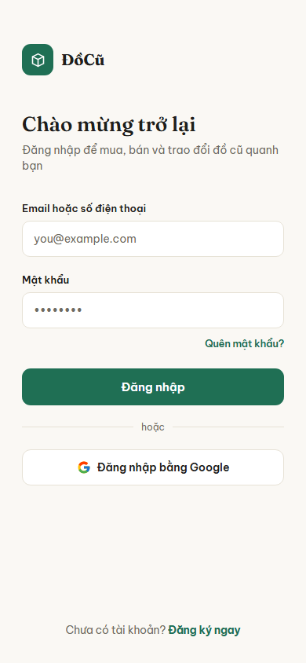
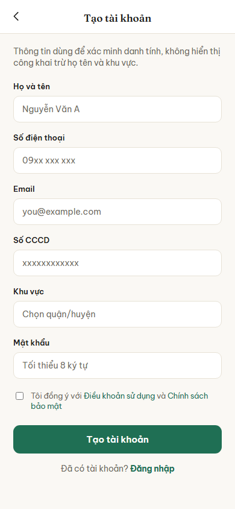
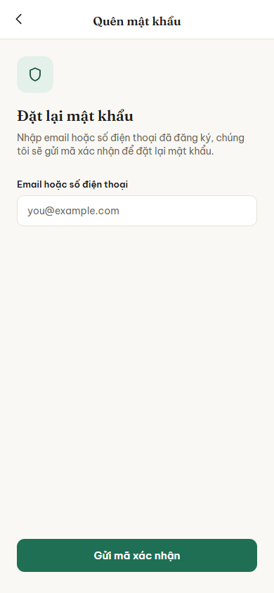
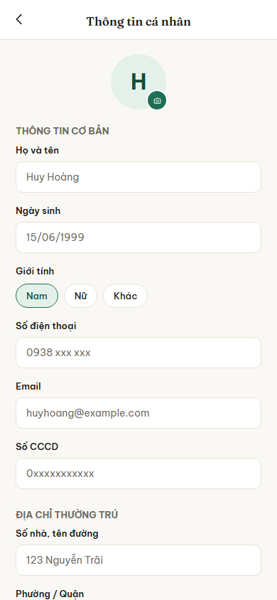
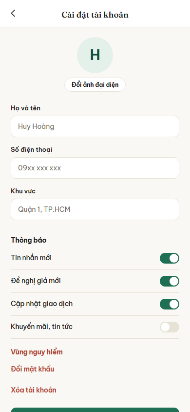
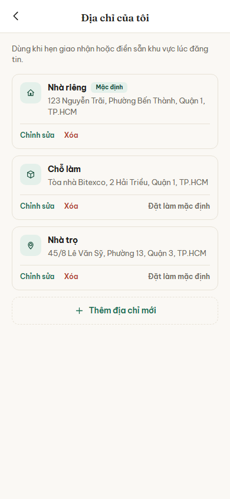

# Nhóm A: Tài khoản và thông tin cá nhân

6 màn hình, nộp theo 3 đợt: đợt 1 một màn (A01), đợt 2 hai màn (A02, A03), đợt 3 ba màn (A04, A05, A06).

## A01. Đăng nhập

**Ảnh:** 

**Mục đích:** Cho người dùng đã có tài khoản vào ứng dụng, bằng email hoặc số điện thoại, hoặc bằng tài khoản Google.

**Thành phần chính:**
- Logo và tên ứng dụng ĐồCũ
- Tiêu đề "Chào mừng trở lại" và một dòng giới thiệu ngắn
- Ô nhập "Email hoặc số điện thoại"
- Ô nhập "Mật khẩu", có thể ẩn hiện ký tự
- Liên kết "Quên mật khẩu?" nằm dưới ô mật khẩu, canh phải
- Nút "Đăng nhập" là nút chính
- Đường kẻ phân cách với chữ "hoặc"
- Nút "Đăng nhập bằng Google" có biểu tượng Google
- Dòng cuối trang: "Chưa có tài khoản? Đăng ký ngay"

**Hành động và điều hướng:**
- Bấm "Đăng nhập" khi đúng thông tin: sang B01 Trang chủ
- Bấm "Đăng nhập bằng Google": sang B01 Trang chủ sau khi chọn tài khoản Google
- Bấm "Quên mật khẩu?": sang A03 Quên mật khẩu
- Bấm "Đăng ký ngay": sang A02 Đăng ký

**Chức năng liên quan:** dòng 1, 2, 3 trong bảng đặc tả chức năng (đăng ký, đăng nhập kèm đăng nhập Google, quên mật khẩu).

**Trạng thái đặc biệt:**
- Sai email hoặc mật khẩu: hiện dòng báo lỗi màu đỏ ngay dưới ô nhập sai, không chuyển màn
- Tài khoản đang bị khóa: hiện thông báo nêu rõ lý do và thời hạn khóa
- Đang gửi yêu cầu: nút "Đăng nhập" chuyển sang trạng thái chờ, không bấm lại được
- Chưa xác thực email: nhắc người dùng mở hộp thư để xác thực trước khi vào

## A02. Đăng ký

**Ảnh:** 

**Mục đích:** Cho phép người dùng chưa có tài khoản tạo tài khoản mới bằng email.

**Thành phần chính:**
- Tiêu đề "Đăng ký" và một dòng hướng dẫn ngắn
- Ô nhập "Tên hiển thị"
- Ô nhập "Email"
- Ô nhập "Mật khẩu", có thể ẩn hiện ký tự
- Ô nhập "Xác nhận mật khẩu", có thể ẩn hiện ký tự
- Nút "Đăng ký" là nút chính
- Đường kẻ phân cách với chữ "hoặc"
- Nút "Đăng nhập bằng Google" có biểu tượng Google
- Dòng cuối trang: "Đã có tài khoản? Đăng nhập"

**Hành động và điều hướng:**
- Bấm "Đăng ký" khi thông tin hợp lệ: hiển thị thông báo yêu cầu xác thực email, sau đó sang A01 Đăng nhập
- Bấm "Đăng nhập bằng Google": sang B01 Trang chủ (nếu chọn tài khoản hợp lệ)
- Bấm "Đăng nhập": trở về A01 Đăng nhập

**Chức năng liên quan:** dòng 1, 2 trong bảng đặc tả chức năng (đăng ký, đăng nhập kèm đăng nhập Google).

**Trạng thái đặc biệt:**
- Email đã tồn tại: hiện dòng báo lỗi màu đỏ ngay dưới ô email
- Mật khẩu không khớp: hiện báo lỗi dưới ô xác nhận mật khẩu
- Mật khẩu quá yếu: hiện báo lỗi (ít nhất 8 ký tự, gồm chữ và số)
- Đang gửi yêu cầu: nút "Đăng ký" chuyển sang trạng thái chờ, không bấm lại được

## A03. Quên mật khẩu

**Ảnh:** 

**Mục đích:** Hỗ trợ người dùng lấy lại quyền truy cập khi quên mật khẩu bằng cách gửi liên kết đặt lại mật khẩu qua email.

**Thành phần chính:**
- Nút mũi tên quay lại ở góc trái trên
- Tiêu đề "Quên mật khẩu" và dòng giải thích "Nhập email của bạn để nhận liên kết đặt lại mật khẩu"
- Ô nhập "Email"
- Nút "Gửi liên kết" là nút chính
- Dòng cuối trang: "Nhớ mật khẩu? Đăng nhập"

**Hành động và điều hướng:**
- Bấm "Gửi liên kết" khi email hợp lệ: thông báo thành công và giữ ở màn hình hiện tại hoặc quay về A01 Đăng nhập
- Bấm nút quay lại hoặc "Đăng nhập": trở về A01 Đăng nhập

**Chức năng liên quan:** dòng 3 trong bảng đặc tả chức năng (quên mật khẩu).

**Trạng thái đặc biệt:**
- Email chưa được đăng ký hoặc sai định dạng: báo lỗi màu đỏ dưới ô nhập
- Đang gửi yêu cầu: nút "Gửi liên kết" chuyển trạng thái chờ
- Đã gửi quá nhiều yêu cầu: thông báo tạm khóa chức năng này trong vài phút

## A04. Quản lý thông tin cá nhân

**Ảnh:** 

**Mục đích:** Trung tâm quản lý các tùy chọn thiết lập, thông tin cá nhân và tài khoản của người dùng.

**Thành phần chính:**
- Nút mũi tên quay lại góc trái trên, tiêu đề "Quản lý thông tin"
- Danh sách các mục cài đặt:
  - Thông tin hồ sơ (Tên hiển thị, avatar)
  - Quản lý địa chỉ
  - Số điện thoại liên kết
  - Email liên kết
- Danh sách các cài đặt ứng dụng:
  - Đổi mật khẩu
  - Cài đặt thông báo
  - Ngôn ngữ (Mặc định: Tiếng Việt)
- Nút "Đăng xuất" màu đỏ nổi bật ở cuối danh sách

**Hành động và điều hướng:**
- Bấm "Thông tin hồ sơ": sang A05 Chỉnh sửa hồ sơ
- Bấm "Quản lý địa chỉ": sang A06 Quản lý địa chỉ
- Bấm "Đổi mật khẩu": hiển thị popup hoặc sang màn nhập mật khẩu mới
- Bấm "Đăng xuất": xóa phiên đăng nhập và chuyển về A01 Đăng nhập
- Bấm nút quay lại: sang D02 Trang cá nhân (hoặc B01 Trang chủ tùy luồng vào)

**Chức năng liên quan:** dòng 4, 5, 6 bảng đặc tả chức năng (chỉnh sửa thông tin cá nhân, ảnh hồ sơ, địa chỉ).

**Trạng thái đặc biệt:**
- Trạng thái chưa liên kết email/số điện thoại: hiển thị chữ "Chưa liên kết" màu xám bên cạnh mục đó
- Bấm Đăng xuất: hiện hộp thoại xác nhận "Bạn có chắc chắn muốn đăng xuất?" trước khi thực hiện

## A05. Chỉnh sửa hồ sơ

**Ảnh:** 

**Mục đích:** Cho phép người dùng cập nhật thông tin hiển thị với công chúng (avatar, tên hiển thị, giới thiệu).

**Thành phần chính:**
- Nút quay lại góc trái trên, tiêu đề "Chỉnh sửa hồ sơ"
- Nút "Lưu" ở góc phải trên
- Khu vực Avatar: hình tròn lớn kèm nút bấm thay đổi ảnh (icon camera)
- Ô nhập "Tên hiển thị" (có giới hạn ký tự)
- Ô nhập "Giới thiệu ngắn" (bio) cho người dùng khác xem

**Hành động và điều hướng:**
- Bấm icon camera: mở thư viện ảnh máy hoặc camera để đổi avatar
- Bấm "Lưu": lưu các thay đổi lên máy chủ và quay về A04 Quản lý thông tin cá nhân
- Bấm nút quay lại: quay về A04 Quản lý thông tin cá nhân (không lưu thay đổi)

**Chức năng liên quan:** dòng 4, 5 trong bảng đặc tả chức năng (Chỉnh sửa thông tin cá nhân, Chỉnh sửa ảnh hồ sơ).

**Trạng thái đặc biệt:**
- Quá giới hạn ký tự: ô nhập hiện viền đỏ và báo chữ nhỏ bên dưới
- Thoát khi chưa lưu: hiện thông báo "Bạn có thay đổi chưa lưu. Bạn có muốn thoát?"
- Đang tải ảnh: hiển thị vòng xoay tải (loading spinner) trên avatar

## A06. Quản lý địa chỉ

**Ảnh:** 

**Mục đích:** Quản lý danh sách các địa chỉ dùng để giao dịch, mua bán hoặc nhận hàng.

**Thành phần chính:**
- Nút quay lại góc trái trên, tiêu đề "Quản lý địa chỉ"
- Nút "Thêm địa chỉ mới" nổi bật
- Danh sách các thẻ địa chỉ đã lưu, mỗi thẻ hiển thị:
  - Tên người nhận và Số điện thoại
  - Chi tiết địa chỉ (Số nhà, đường, phường/xã, quận/huyện, tỉnh/thành)
  - Badge "Mặc định" cho địa chỉ chính
  - Nút "Sửa" và "Xóa"

**Hành động và điều hướng:**
- Bấm "Thêm địa chỉ mới": mở màn hình/popup nhập thông tin địa chỉ mới
- Bấm "Sửa" trên thẻ: mở form chỉnh sửa cho địa chỉ tương ứng
- Bấm "Xóa" trên thẻ: xóa địa chỉ khỏi danh sách
- Bấm nút quay lại: quay về A04 Quản lý thông tin cá nhân

**Chức năng liên quan:** dòng 6 trong bảng đặc tả chức năng (Chỉnh sửa địa chỉ).

**Trạng thái đặc biệt:**
- Danh sách trống: hiển thị hình minh họa trống và dòng chữ "Bạn chưa có địa chỉ nào"
- Xóa địa chỉ: bật hộp thoại xác nhận xóa
- Không thể xóa địa chỉ mặc định duy nhất: nếu chỉ có 1 địa chỉ, ẩn hoặc làm mờ nút xóa
