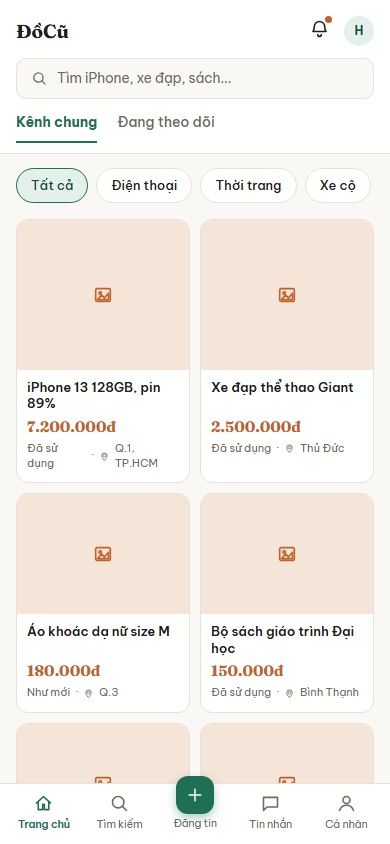
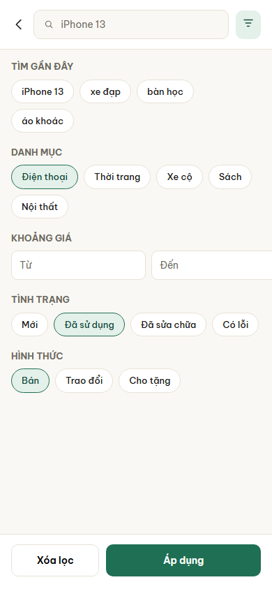
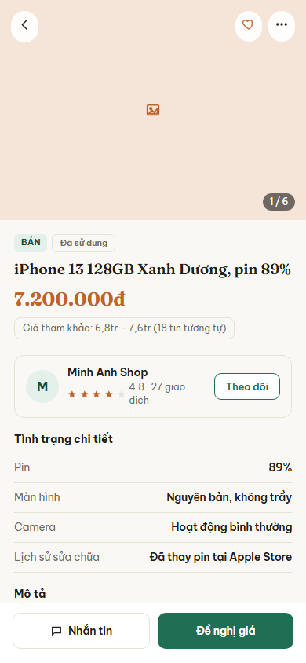
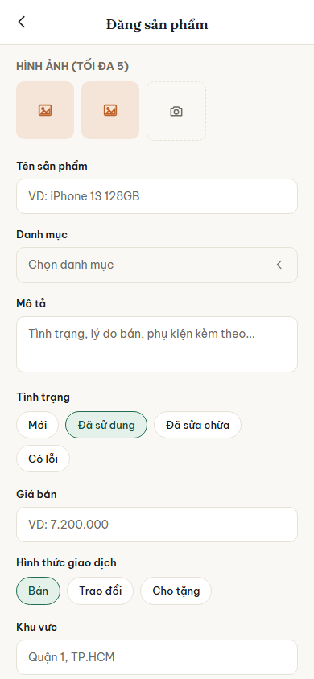
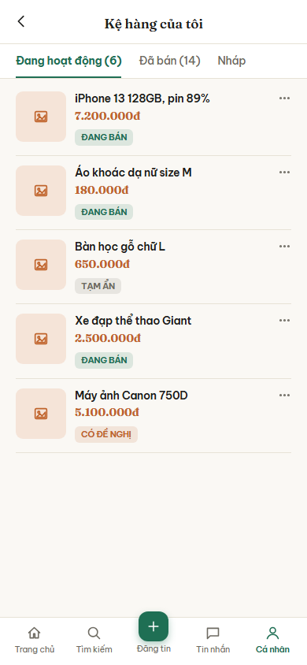
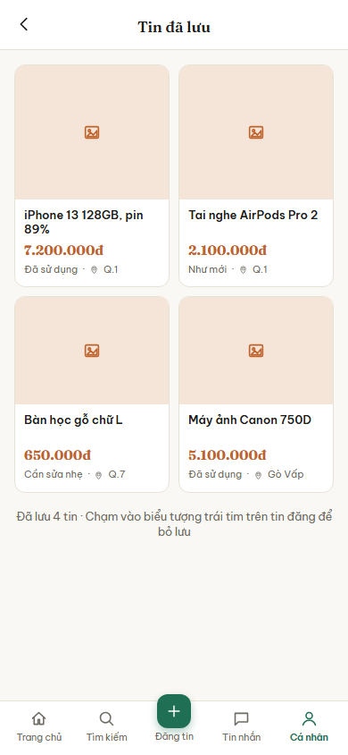

# Nhóm B: Khám phá và tin đăng

6 màn hình, nộp theo 3 đợt: đợt 1 một màn (B01), đợt 2 hai màn (B02, B03), đợt 3 ba màn (B04, B05, B06).

## B01. Trang chủ

**Ảnh:** 

**Mục đích:** Màn hình chính sau khi đăng nhập, nơi người dùng lướt xem tin đăng mới và tìm nhanh món đồ mình cần.

**Thành phần chính:**
- Thanh trên cùng: tên ứng dụng ĐồCũ, chuông thông báo có chấm đỏ khi có thông báo chưa đọc, ảnh đại diện người dùng
- Ô tìm kiếm với gợi ý "Tìm iPhone, xe đạp, sách..."
- Hai thẻ chuyển kênh: "Kênh chung" và "Đang theo dõi"
- Hàng lọc nhanh theo danh mục: Tất cả, Điện thoại, Thời trang, Xe cộ
- Lưới tin đăng hai cột, mỗi thẻ có ảnh, tên món đồ, giá, tình trạng và khu vực
- Thanh điều hướng dưới cùng 5 mục: Trang chủ, Tìm kiếm, Đăng tin (nút tròn nổi ở giữa), Tin nhắn, Cá nhân

**Hành động và điều hướng:**
- Bấm ô tìm kiếm: sang B02 Tìm kiếm và bộ lọc
- Bấm một thẻ tin đăng: sang B03 Chi tiết tin đăng
- Bấm nút tròn "Đăng tin": sang B04 Đăng tin
- Bấm "Tin nhắn" ở thanh dưới: sang C01 Danh sách tin nhắn
- Bấm "Cá nhân" ở thanh dưới: sang D01 Hồ sơ cá nhân
- Bấm chuông thông báo: sang C06 Thông báo
- Chuyển thẻ "Đang theo dõi": vẫn ở màn này, lưới chỉ còn tin của người đang theo dõi

**Chức năng liên quan:** dòng 24, 25 (kênh chung, kênh đang theo dõi), dòng 17, 19 (danh mục), dòng 31, 32 (gợi ý sản phẩm, mục Dành cho bạn) trong bảng đặc tả chức năng.

**Trạng thái đặc biệt:**
- Chưa có tin nào khớp bộ lọc: hiện dòng chữ báo trống thay cho lưới
- Đang tải thêm khi cuộn xuống: hiện các ô xám mờ ở cuối lưới
- Mất mạng: hiện lại các tin đã xem gần đây lấy từ bộ nhớ đệm, kèm dải báo đang xem ngoại tuyến
- Thẻ "Đang theo dõi" khi chưa theo dõi ai: gợi ý người dùng tìm và theo dõi người bán

## B02. Tìm kiếm và bộ lọc

**Ảnh:** 

**Mục đích:** Hỗ trợ người dùng tra cứu tin đăng bằng từ khóa và thu hẹp phạm vi kết quả theo các tiêu chí (danh mục, khoảng giá, tình trạng, hình thức).

**Thành phần chính:**
- Thanh trên cùng: nút quay lại, ô nhập từ khóa tìm kiếm (đang nhập "iPhone 13"), nút đóng bộ lọc (hiển thị biểu tượng menu)
- Khu vực Tìm gần đây: các thẻ từ khóa lịch sử (iPhone 13, xe đạp, bàn học, áo khoác)
- Khu vực chọn tiêu chí lọc: Danh mục, Khoảng giá (Từ - Đến), Tình trạng (Mới, Đã sử dụng, Đã sửa chữa, Có lỗi), Hình thức (Bán, Trao đổi, Cho tặng)
- Thanh dưới cùng: Nút "Xóa lọc" và nút "Áp dụng"

**Hành động và điều hướng:**
- Bấm nút quay lại: trở về B01 Trang chủ
- Bấm vào một thẻ lịch sử tìm kiếm: điền ngay từ khóa đó vào ô tìm kiếm
- Bấm chọn các thẻ tiêu chí: thẻ đổi màu biểu thị trạng thái đang được chọn
- Bấm "Xóa lọc": bỏ chọn toàn bộ tiêu chí lọc hiện tại
- Bấm "Áp dụng": trở lại B01 Trang chủ với danh sách tin đăng đã được lọc theo tiêu chí
- Bấm nút menu lọc trên cùng: đóng bảng bộ lọc

**Chức năng liên quan:** dòng 27 (Tìm kiếm), 28 (Lọc tin), 29 (Lịch sử tìm kiếm) trong bảng đặc tả chức năng.

**Trạng thái đặc biệt:**
- Nhập giá "Đến" thấp hơn giá "Từ": hiển thị lỗi màu đỏ nhắc nhở ngay dưới ô giá
- Không có từ khóa tìm kiếm gần đây: ẩn khu vực "TÌM GẦN ĐÂY"

## B03. Chi tiết tin đăng

**Ảnh:** 

**Mục đích:** Hiển thị thông tin đầy đủ nhất về một món đồ, đồng thời cung cấp điểm chạm để người mua liên hệ người bán hoặc chốt giao dịch nhanh.

**Thành phần chính:**
- Khu vực ảnh phía trên: băng chuyền ảnh, đếm số ảnh (1/6), nút quay lại, nút thả tim (Lưu tin) và nút ba chấm (Menu phụ)
- Khối thông tin cốt lõi: Nhãn loại tin (BÁN), tình trạng (Đã sử dụng), Tên sản phẩm, Giá tiền, và dải gợi ý giá tham khảo dựa trên thị trường
- Thẻ người bán: Avatar, Tên shop (Minh Anh Shop), điểm đánh giá sao, số giao dịch, và nút "Theo dõi"
- Khu vực "Tình trạng chi tiết": liệt kê cụ thể các thông số do người bán nhập (Pin, Màn hình, Camera, Lịch sử sửa chữa)
- Thanh hành động dưới cùng cố định: Nút "Nhắn tin" và nút "Đề nghị giá" nổi bật

**Hành động và điều hướng:**
- Bấm nút quay lại: trở về màn hình trước đó (B01 hoặc màn hình nào đã gọi nó)
- Bấm nút thả tim: lưu tin vào danh sách yêu thích, biểu tượng tim chuyển sang màu đỏ
- Bấm nút "Theo dõi" ở thẻ người bán: theo dõi người bán này
- Bấm nút ba chấm: mở menu phụ (báo cáo tin, chia sẻ)
- Bấm thẻ người bán: sang D01 Hồ sơ cá nhân của người bán
- Bấm "Nhắn tin": chuyển sang C02 Cửa sổ chat với người bán, tự động đính kèm tin đăng này
- Bấm "Đề nghị giá": mở popup hoặc chuyển sang màn hình trả giá/chốt deal nhanh

**Chức năng liên quan:** dòng 30 (Xem chi tiết tin đăng), 37 (Lưu tin/Bỏ lưu), 36 (Theo dõi người bán), 44 (Đề nghị giá) trong bảng đặc tả chức năng.

**Trạng thái đặc biệt:**
- Tin đăng của chính mình: nút "Nhắn tin/Đề nghị giá" biến thành nút "Chỉnh sửa/Đã bán"
- Tin đã bán: nút bị làm xám, hiện nhãn "ĐÃ BÁN" đè lên ảnh sản phẩm
- Chưa đăng nhập: bấm "Nhắn tin" hoặc "Lưu tin" sẽ bật màn hình yêu cầu đăng nhập

## B04. Đăng tin

**Ảnh:** 

**Mục đích:** Cung cấp biểu mẫu (form) để người dùng tạo mới một bài đăng bán/trao đổi/cho tặng món đồ.

**Thành phần chính:**
- Thanh trên cùng: nút quay lại và tiêu đề "Đăng sản phẩm"
- Khu vực ảnh: nhãn "HÌNH ẢNH (TỐI ĐA 5)", các ô chứa ảnh đã chọn và một ô có biểu tượng camera để chụp/chọn ảnh mới
- Các trường thông tin (từ trên xuống dưới):
  - Tên sản phẩm: ô nhập text (VD: iPhone 13 128GB)
  - Danh mục: ô chọn dropdown (Chọn danh mục)
  - Mô tả: ô nhập text nhiều dòng (Tình trạng, lý do bán, phụ kiện kèm theo...)
  - Tình trạng: các thẻ tùy chọn (Mới, Đã sử dụng, Đã sửa chữa, Có lỗi)
  - Giá bán: ô nhập số (VD: 7.200.000)
  - Hình thức giao dịch: các thẻ tùy chọn (Bán, Trao đổi, Cho tặng)
  - Khu vực: ô nhập/chọn text (VD: Quận 1, TP.HCM)
- Nút "Đăng tin" (Nằm ở cuối màn hình, cuộn xuống sẽ thấy)

**Hành động và điều hướng:**
- Bấm nút quay lại: hủy bỏ việc đăng tin, quay lại màn hình trước đó
- Bấm biểu tượng camera: mở thư viện ảnh hoặc camera để tải ảnh lên
- Bấm vào Danh mục: mở danh sách các danh mục để chọn
- Bấm chọn các thẻ (Tình trạng, Hình thức): thẻ chuyển sang màu xanh lá biểu thị đang được chọn
- Bấm nút Đăng tin (khi cuộn xuống): lưu dữ liệu lên server và chuyển tới màn hình B05 Kệ hàng của tôi hoặc chi tiết tin vừa đăng

**Chức năng liên quan:** dòng 10 (Chỉnh sửa nội dung), 11 (Chỉnh sửa hình ảnh), 12 (Hình thức giao dịch), 13 (Giá cả), 15 (Danh mục) trong bảng đặc tả chức năng.

**Trạng thái đặc biệt:**
- Nếu để trống trường bắt buộc (Tên, Giá, Hình ảnh): hiển thị thông báo lỗi màu đỏ khi bấm Đăng tin
- Vượt quá 5 ảnh: ẩn nút thêm ảnh

## B05. Kệ hàng của tôi

**Ảnh:** 

**Mục đích:** Nơi người dùng quản lý toàn bộ bài đăng cá nhân, theo dõi trạng thái các món đồ đang bán, đã bán hoặc nháp.

**Thành phần chính:**
- Thanh trên cùng: nút quay lại và tiêu đề "Kệ hàng của tôi"
- Thanh tab phân loại: Đang hoạt động (6), Đã bán (14), Nháp
- Danh sách tin đăng hiển thị theo thẻ ngang. Mỗi thẻ gồm: Ảnh đại diện, Tên sản phẩm, Giá tiền, Nhãn trạng thái (ĐANG BÁN, TẠM ẨN, CÓ ĐỀ NGHỊ) và Nút ba chấm (menu thao tác)
- Thanh điều hướng dưới cùng 5 mục (Tab "Cá nhân" đang được chọn)

**Hành động và điều hướng:**
- Bấm nút quay lại: trở về trang D01 Hồ sơ cá nhân
- Chuyển tab trên thanh phân loại: lọc hiển thị danh sách tin tương ứng với trạng thái
- Bấm vào một thẻ tin đăng: sang màn hình B03 Chi tiết tin đăng tương ứng
- Bấm nút ba chấm trên một thẻ: mở menu thao tác nhanh (Chỉnh sửa, Đánh dấu đã bán, Ẩn tin, Xóa tin)
- Bấm các nút ở thanh điều hướng dưới cùng: chuyển sang màn hình chức năng chính (Trang chủ, Tìm kiếm, Đăng tin, Tin nhắn)

**Chức năng liên quan:** dòng 8 (Chỉnh sửa sản phẩm trên kệ), 9 (Sắp xếp sản phẩm) trong bảng đặc tả chức năng.

**Trạng thái đặc biệt:**
- Không có tin nào trong tab: hiển thị minh họa trống "Bạn chưa có tin đăng nào ở mục này"
- Nhãn CÓ ĐỀ NGHỊ nổi bật màu cam để thu hút sự chú ý của người bán

## B06. Tin đã lưu

**Ảnh:** 

**Mục đích:** Lưu trữ các tin đăng mà người dùng quan tâm để dễ dàng xem lại, cân nhắc và đưa ra quyết định sau.

**Thành phần chính:**
- Thanh trên cùng: nút quay lại và tiêu đề "Tin đã lưu"
- Lưới tin đăng 2 cột tương tự Trang chủ: mỗi thẻ có ảnh, tên sản phẩm, giá, tình trạng (Đã sử dụng, Như mới, Cần sửa nhẹ) và khu vực (Q.1, Q.7, Gò Vấp)
- Dòng thống kê phía dưới danh sách: "Đã lưu 4 tin · Chạm vào biểu tượng trái tim trên tin đăng để bỏ lưu"
- Thanh điều hướng dưới cùng 5 mục (Tab "Cá nhân" đang được chọn)

**Hành động và điều hướng:**
- Bấm nút quay lại: trở về trang D01 Hồ sơ cá nhân
- Bấm vào thẻ tin đăng: sang màn hình B03 Chi tiết tin đăng để xem hoặc nhắn tin
- Chạm vào biểu tượng trái tim trên thẻ (nếu có, hoặc trong chi tiết): bỏ lưu tin, tin sẽ biến mất khỏi danh sách sau khi làm mới
- Bấm các mục ở thanh điều hướng dưới cùng: chuyển kênh ứng dụng

**Chức năng liên quan:** dòng 32 (Lưu tin yêu thích - Lưu tin) trong bảng đặc tả chức năng.

**Trạng thái đặc biệt:**
- Nếu tin gốc đã bị người bán xóa hoặc đã bán: thẻ có thể hiển thị nhãn "ĐÃ BÁN" hoặc bị làm mờ, không thể xem chi tiết
- Danh sách rỗng: hiển thị hình ảnh minh họa "Bạn chưa lưu tin nào"
