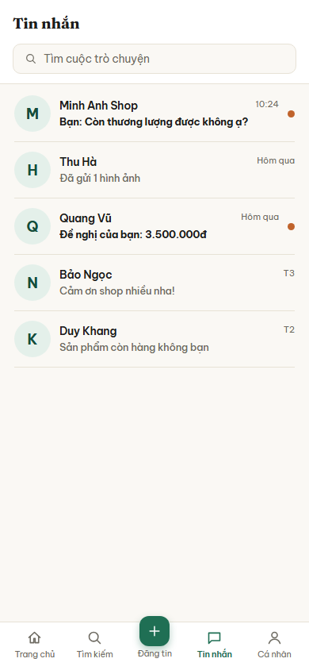

# Nhóm C: Kết nối và giao dịch

6 màn hình, nộp theo 3 đợt: đợt 1 một màn (C01), đợt 2 hai màn (C02, C03), đợt 3 ba màn (C04, C05, C06).

## C01. Danh sách tin nhắn

**Ảnh:** 

**Mục đích:** Cho người dùng xem toàn bộ cuộc trò chuyện đang có với người mua hoặc người bán, và biết cuộc nào có tin chưa đọc.

**Thành phần chính:**
- Tiêu đề "Tin nhắn"
- Ô tìm kiếm với gợi ý "Tìm cuộc trò chuyện"
- Danh sách cuộc trò chuyện, mỗi dòng gồm: ảnh đại diện chữ cái đầu, tên người đối thoại, đoạn tin nhắn gần nhất, thời điểm gần nhất
- Chấm tròn màu cam ở cuối dòng khi cuộc trò chuyện đó có tin chưa đọc
- Dòng có đề nghị giá hiển thị nội dung dạng "Đề nghị của bạn: 3.500.000đ"
- Thanh điều hướng dưới cùng 5 mục: Trang chủ, Tìm kiếm, Đăng tin, Tin nhắn, Cá nhân; mục "Tin nhắn" đang được chọn

**Hành động và điều hướng:**
- Bấm một cuộc trò chuyện: sang C02 Trò chuyện và đề nghị giá
- Gõ vào ô tìm kiếm: lọc danh sách ngay tại màn này, không chuyển màn
- Bấm "Trang chủ" ở thanh dưới: sang B01 Trang chủ
- Bấm "Tìm kiếm" ở thanh dưới: sang B02 Tìm kiếm và bộ lọc
- Bấm "Đăng tin" ở thanh dưới: sang B04 Đăng tin
- Bấm "Cá nhân" ở thanh dưới: sang D01 Hồ sơ cá nhân

**Chức năng liên quan:** dòng 37, 38, 39 (chat gửi chữ, ảnh, video), dòng 40, 41, 42 (offer một chạm) trong bảng đặc tả chức năng.

**Trạng thái đặc biệt:**
- Chưa có cuộc trò chuyện nào: hiện dòng chữ gợi ý người dùng vào xem tin đăng và nhắn cho người bán
- Tin chưa đọc: tên và nội dung in đậm, kèm chấm tròn màu cam
- Mất mạng: hiện lại danh sách đã tải trước đó từ bộ nhớ đệm, kèm dải báo đang xem ngoại tuyến
- Tìm không ra kết quả: hiện dòng báo không có cuộc trò chuyện nào khớp

## C02. Trò chuyện và đề nghị giá

**Ảnh:** chưa nộp

**Mục đích:**

**Thành phần chính:**
-

**Hành động và điều hướng:**
-

**Chức năng liên quan:**

**Trạng thái đặc biệt:**
-

## C03. Chi tiết giao dịch

**Ảnh:** chưa nộp

**Mục đích:**

**Thành phần chính:**
-

**Hành động và điều hướng:**
-

**Chức năng liên quan:**

**Trạng thái đặc biệt:**
-

## C04. Lịch sử giao dịch

**Ảnh:** chưa nộp

**Mục đích:**

**Thành phần chính:**
-

**Hành động và điều hướng:**
-

**Chức năng liên quan:**

**Trạng thái đặc biệt:**
-

## C05. Viết đánh giá

**Ảnh:** chưa nộp

**Mục đích:**

**Thành phần chính:**
-

**Hành động và điều hướng:**
-

**Chức năng liên quan:**

**Trạng thái đặc biệt:**
-

## C06. Thông báo

**Ảnh:** chưa nộp

**Mục đích:**

**Thành phần chính:**
-

**Hành động và điều hướng:**
-

**Chức năng liên quan:**

**Trạng thái đặc biệt:**
-
