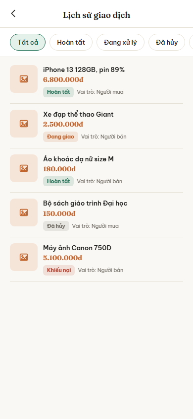
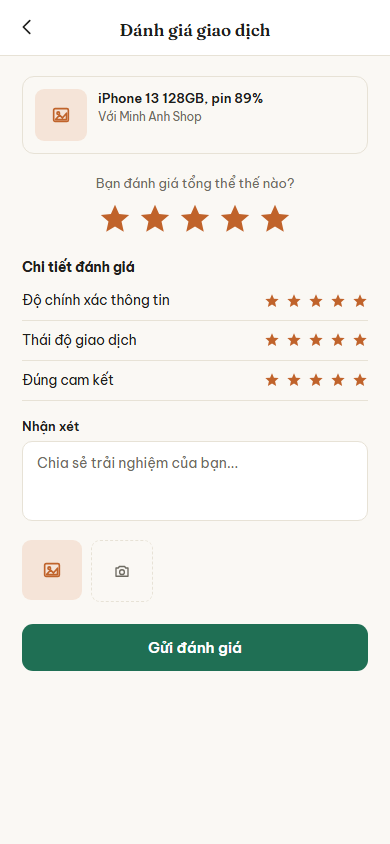
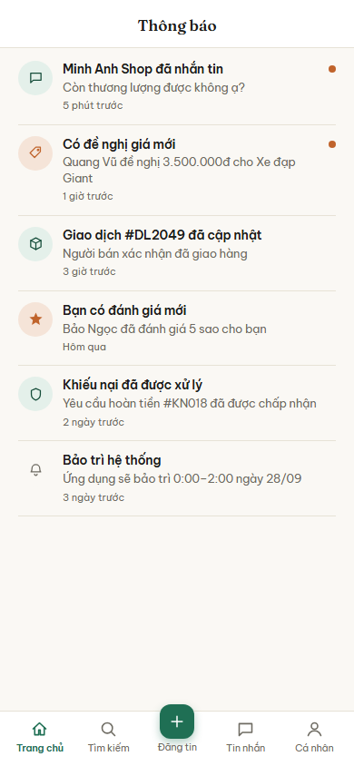

# Nhóm C: Kết nối và giao dịch

6 màn hình, nộp theo 3 đợt: đợt 1 một màn (C01), đợt 2 hai màn (C02, C03), đợt 3 ba màn (C04, C05, C06).

## C01. Danh sách tin nhắn

**Ảnh:** 

**Mục đích:** Cho người dùng xem toàn bộ cuộc trò chuyện đang có với người mua hoặc người bán, và biết cuộc nào có tin chưa đọc.

**Thành phần chính:**
- Tiêu đề "Tin nhắn"
- Ô tìm kiếm với gợi ý "Tìm cuộc trò chuyện"
- Danh sách cuộc trò chuyện, mỗi dòng gồm: ảnh đại diện chữ cái đầu, tên người đối thoại, đoạn tin nhắn gần nhất, thời điểm gần nhất
- Chấm tròn màu cam ở cuối dòng khi cuộc trò chuyện đó có tin chưa đọc
- Dòng có đề nghị giá hiển thị nội dung dạng "Đề nghị của bạn: 3.500.000đ"
- Thanh điều hướng dưới cùng 5 mục: Trang chủ, Tìm kiếm, Đăng tin, Tin nhắn, Cá nhân; mục "Tin nhắn" đang được chọn

**Hành động và điều hướng:**
- Bấm một cuộc trò chuyện: sang C02 Trò chuyện và đề nghị giá
- Gõ vào ô tìm kiếm: lọc danh sách ngay tại màn này, không chuyển màn
- Bấm "Trang chủ" ở thanh dưới: sang B01 Trang chủ
- Bấm "Tìm kiếm" ở thanh dưới: sang B02 Tìm kiếm và bộ lọc
- Bấm "Đăng tin" ở thanh dưới: sang B04 Đăng tin
- Bấm "Cá nhân" ở thanh dưới: sang D01 Hồ sơ cá nhân

**Chức năng liên quan:** dòng 37, 38, 39 (chat gửi chữ, ảnh, video), dòng 40, 41, 42 (offer một chạm) trong bảng đặc tả chức năng.

**Trạng thái đặc biệt:**
- Chưa có cuộc trò chuyện nào: hiện dòng chữ gợi ý người dùng vào xem tin đăng và nhắn cho người bán
- Tin chưa đọc: tên và nội dung in đậm, kèm chấm tròn màu cam
- Mất mạng: hiện lại danh sách đã tải trước đó từ bộ nhớ đệm, kèm dải báo đang xem ngoại tuyến
- Tìm không ra kết quả: hiện dòng báo không có cuộc trò chuyện nào khớp

## C02. Trò chuyện và đề nghị giá

**Ảnh:** 

**Mục đích:** Cho phép người dùng trao đổi chi tiết về sản phẩm và thực hiện thương lượng, chốt giá trực tiếp trong khung chat.

**Thành phần chính:**
- Thanh tiêu đề trên cùng: Nút quay lại, ảnh đại diện, tên người đối thoại, trạng thái hoạt động ("Đang hoạt động"), nút tùy chọn (3 chấm).
- Banner sản phẩm đang trao đổi: Ảnh thu nhỏ, tên sản phẩm ("iPhone 13 128GB..."), mức giá.
- Khung nội dung chat: Các bong bóng tin nhắn của mình và đối phương.
- Thẻ "Đề nghị giá" đặc biệt trong luồng chat: Hiện mức giá đề nghị (ví dụ 6.800.000đ) kèm hai nút hành động "Từ chối" và "Chấp nhận".
- Thanh nhập liệu dưới cùng: Nút đính kèm tệp (biểu tượng kẹp ghim), ô nhập tin nhắn, nút gửi.

**Hành động và điều hướng:**
- Bấm nút quay lại `<`: Về C01 Danh sách tin nhắn.
- Bấm nút menu 3 chấm: Mở popup tùy chọn (chặn, báo cáo).
- Bấm vào banner sản phẩm: Xem lại màn hình B03 Chi tiết tin đăng.
- Bấm "Chấp nhận" trên thẻ đề nghị giá: Chốt giao dịch, có thể dẫn sang tạo hoặc xác nhận đơn (C03).
- Bấm nút đính kèm: Mở menu chọn gửi ảnh/video từ máy.
- Bấm nút gửi: Đẩy tin nhắn mới vào cuộc trò chuyện.

**Chức năng liên quan:** dòng 37, 38, 39 (chat gửi chữ, ảnh, video), dòng 40, 41, 42 (offer một chạm).

**Trạng thái đặc biệt:**
- Nếu là người gửi đề nghị: Thẻ đề nghị giá chỉ hiện nội dung "Đang chờ phản hồi" hoặc nút "Hủy đề nghị", không có nút Chấp nhận/Từ chối.
- Khi mất mạng: Nút gửi bị mờ hoặc tin nhắn vừa gửi hiện biểu tượng đang gửi (xoay vòng).

## C03. Chi tiết giao dịch

**Ảnh:** 

**Mục đích:** Quản lý và theo dõi tiến trình của một giao dịch cụ thể đã được chốt, cung cấp thông tin hẹn gặp và các hành động hoàn tất hay khiếu nại.

**Thành phần chính:**
- Thanh tiêu đề: Nút quay lại, mã giao dịch (ví dụ "#DL2049").
- Thanh tiến trình giao dịch 5 bước: Chờ xác nhận, Đã xác nhận, Đang giao, Đã nhận, Hoàn tất. Trạng thái hiện tại được đánh dấu nổi bật.
- Thẻ sản phẩm: Ảnh thu nhỏ, tên, giá chốt.
- Khối "Thông tin giao dịch": Phương thức thanh toán (Ví trung gian), Phương thức giao nhận (Gặp trực tiếp), Địa điểm (Cà phê Highlands...), Thời gian hẹn.
- Hộp cảnh báo an toàn: Nhắc nhở tiền được giữ an toàn tại ví trung gian.
- Các nút hành động lớn ở dưới: "Xác nhận đã nhận hàng" (màu xanh), "Khiếu nại giao dịch" (viền đỏ).

**Hành động và điều hướng:**
- Bấm nút quay lại `<`: Về màn hình trước (ví dụ C02 Trò chuyện hoặc C04 Lịch sử giao dịch).
- Bấm "Xác nhận đã nhận hàng": Đổi trạng thái giao dịch sang "Đã nhận", kích hoạt giải ngân tự động cho người bán.
- Bấm "Khiếu nại giao dịch": Chuyển sang màn hình D05 Tạo khiếu nại.

**Chức năng liên quan:** dòng 56 (Xem chi tiết giao dịch), dòng 57 (Cập nhật trạng thái / Xác nhận nhận hàng), dòng 71 (Tạo khiếu nại).

**Trạng thái đặc biệt:**
- Phụ thuộc vai trò: Nếu người xem là Người bán, nút hành động sẽ là "Xác nhận đã giao hàng" thay vì nhận hàng.
- Thanh toán trực tiếp: Hộp cảnh báo về "ví trung gian" sẽ được ẩn đi.

## C04. Lịch sử giao dịch

**Ảnh:** 

**Mục đích:** Giúp người dùng xem lại toàn bộ các giao dịch đã thực hiện trên ứng dụng (cả vai trò người mua và người bán) và theo dõi tình trạng của chúng.

**Thành phần chính:**
- Thanh tiêu đề: Nút quay lại, tiêu đề "Lịch sử giao dịch".
- Thanh bộ lọc trạng thái (dạng chip): Tất cả, Hoàn tất, Đang xử lý, Đã hủy.
- Danh sách giao dịch: Mỗi thẻ hiển thị ảnh sản phẩm, tên sản phẩm, giá tiền (màu cam).
- Nhãn trạng thái và vai trò: Thể hiện trên từng thẻ (ví dụ nhãn "Hoàn tất" màu xanh lục, "Đang giao" màu cam, "Đã hủy" màu xám, "Khiếu nại" màu đỏ) và dòng chữ "Vai trò: Người mua" hoặc "Người bán".

**Hành động và điều hướng:**
- Bấm nút quay lại `<`: Về màn hình D01 Hồ sơ cá nhân.
- Bấm chọn các chip lọc trạng thái: Lọc danh sách giao dịch tương ứng ngay trên màn hình.
- Bấm vào một thẻ giao dịch: Sang C03 Chi tiết giao dịch đó.

**Chức năng liên quan:** dòng 50 (Lịch sử giao dịch).

**Trạng thái đặc biệt:**
- Nếu danh sách trống: Hiện thông báo "Bạn chưa có giao dịch nào".

## C05. Viết đánh giá

**Ảnh:** 

**Mục đích:** Cho phép người dùng đánh giá đối tác sau khi giao dịch hoàn tất nhằm xây dựng điểm uy tín trong cộng đồng.

**Thành phần chính:**
- Thanh tiêu đề: Nút quay lại, tiêu đề "Đánh giá giao dịch".
- Khối thông tin đối tác: Ảnh thu nhỏ, tên sản phẩm, dòng "Với Minh Anh Shop".
- Đánh giá tổng thể: Tiêu đề "Bạn đánh giá tổng thể thế nào?" kèm dãy 5 ngôi sao lớn.
- Chi tiết đánh giá: Các tiêu chí bổ sung (Độ chính xác thông tin, Thái độ giao dịch, Đúng cam kết) kèm đánh giá sao riêng.
- Ô nhận xét: Khung nhập văn bản "Chia sẻ trải nghiệm của bạn...".
- Tải ảnh đính kèm: Nút tải ảnh từ thư viện, nút chụp ảnh mới.
- Nút "Gửi đánh giá": Nút màu xanh nổi bật ở cuối màn hình.

**Hành động và điều hướng:**
- Bấm vào các ngôi sao: Chạm để chọn số sao (từ 1 đến 5) cho mục tương ứng.
- Nhập văn bản vào ô nhận xét: Điền mô tả chi tiết đánh giá.
- Bấm nút ảnh/camera: Thêm hình ảnh minh họa cho đánh giá (ví dụ ảnh sản phẩm thực tế nhận được).
- Bấm "Gửi đánh giá": Lưu đánh giá, hiển thị thông báo thành công và chuyển về màn hình trước.
- Bấm nút quay lại `<`: Hủy viết đánh giá và quay về màn C03.

**Chức năng liên quan:** dòng 52 (Đánh giá đối tác).

**Trạng thái đặc biệt:**
- Nút "Gửi đánh giá" bị vô hiệu hóa (mờ đi) nếu người dùng chưa chọn số sao ở phần "Đánh giá tổng thể".

## C06. Thông báo

**Ảnh:** 

**Mục đích:** Hiển thị tất cả các thông báo cập nhật về tin nhắn, đề nghị giá, giao dịch, đánh giá, khiếu nại và thông báo hệ thống cho người dùng.

**Thành phần chính:**
- Thanh tiêu đề: Tiêu đề "Thông báo".
- Danh sách thông báo: Mỗi dòng gồm biểu tượng (icon) phân loại, tiêu đề in đậm, nội dung tóm tắt, thời gian nhận (ví dụ "5 phút trước", "Hôm qua").
- Đánh dấu chưa đọc: Chấm tròn màu cam xuất hiện bên phải đối với các thông báo người dùng chưa bấm xem.
- Thanh điều hướng dưới cùng: Giữ nguyên thanh menu chính của ứng dụng (Trang chủ, Tìm kiếm, Đăng tin, Tin nhắn, Cá nhân).

**Hành động và điều hướng:**
- Bấm vào một thông báo bất kỳ: Chuyển thẳng đến màn hình tương ứng của sự kiện (VD: thông báo tin nhắn sang C02, thông báo giao dịch cập nhật sang C03, thông báo đánh giá mới sang D03...).
- Cuộn dọc danh sách: Xem thêm các thông báo cũ hơn.
- Bấm các nút ở thanh dưới cùng: Chuyển đổi giữa các tab chính của ứng dụng.

**Chức năng liên quan:** dòng 91 (Thông báo hệ thống) và các tính năng kích hoạt thông báo tương ứng.

**Trạng thái đặc biệt:**
- Trống: Hiện hình minh họa "Bạn chưa có thông báo mới" khi không có bất kỳ thông báo nào.
- Load thêm: Khi người dùng kéo xuống dưới cùng, ứng dụng sẽ tải thêm (pagination) các thông báo cũ.
