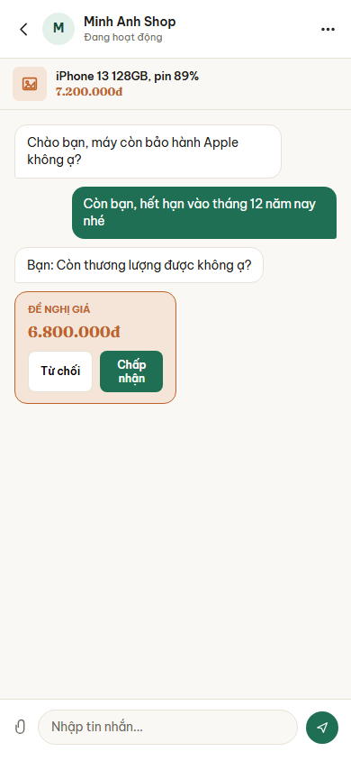
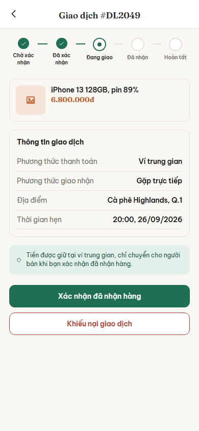

# Nhóm C: Kết nối và giao dịch

6 màn hình, nộp theo 3 đợt: đợt 1 một màn (C01), đợt 2 hai màn (C02, C03), đợt 3 ba màn (C04, C05, C06).

## C01. Danh sách tin nhắn

**Ảnh:** 

**Mục đích:** Cho người dùng xem toàn bộ cuộc trò chuyện đang có với người mua hoặc người bán, và biết cuộc nào có tin chưa đọc.

**Thành phần chính:**
- Tiêu đề "Tin nhắn"
- Ô tìm kiếm với gợi ý "Tìm cuộc trò chuyện"
- Danh sách cuộc trò chuyện, mỗi dòng gồm: ảnh đại diện chữ cái đầu, tên người đối thoại, đoạn tin nhắn gần nhất, thời điểm gần nhất
- Chấm tròn màu cam ở cuối dòng khi cuộc trò chuyện đó có tin chưa đọc
- Dòng có đề nghị giá hiển thị nội dung dạng "Đề nghị của bạn: 3.500.000đ"
- Thanh điều hướng dưới cùng 5 mục: Trang chủ, Tìm kiếm, Đăng tin, Tin nhắn, Cá nhân; mục "Tin nhắn" đang được chọn

**Hành động và điều hướng:**
- Bấm một cuộc trò chuyện: sang C02 Trò chuyện và đề nghị giá
- Gõ vào ô tìm kiếm: lọc danh sách ngay tại màn này, không chuyển màn
- Bấm "Trang chủ" ở thanh dưới: sang B01 Trang chủ
- Bấm "Tìm kiếm" ở thanh dưới: sang B02 Tìm kiếm và bộ lọc
- Bấm "Đăng tin" ở thanh dưới: sang B04 Đăng tin
- Bấm "Cá nhân" ở thanh dưới: sang D01 Hồ sơ cá nhân

**Chức năng liên quan:** dòng 37, 38, 39 (chat gửi chữ, ảnh, video), dòng 40, 41, 42 (offer một chạm) trong bảng đặc tả chức năng.

**Trạng thái đặc biệt:**
- Chưa có cuộc trò chuyện nào: hiện dòng chữ gợi ý người dùng vào xem tin đăng và nhắn cho người bán
- Tin chưa đọc: tên và nội dung in đậm, kèm chấm tròn màu cam
- Mất mạng: hiện lại danh sách đã tải trước đó từ bộ nhớ đệm, kèm dải báo đang xem ngoại tuyến
- Tìm không ra kết quả: hiện dòng báo không có cuộc trò chuyện nào khớp

## C02. Trò chuyện và đề nghị giá

**Ảnh:** 

**Mục đích:** Cho phép người dùng trao đổi chi tiết về sản phẩm và thực hiện thương lượng, chốt giá trực tiếp trong khung chat.

**Thành phần chính:**
- Thanh tiêu đề trên cùng: Nút quay lại, ảnh đại diện, tên người đối thoại, trạng thái hoạt động ("Đang hoạt động"), nút tùy chọn (3 chấm).
- Banner sản phẩm đang trao đổi: Ảnh thu nhỏ, tên sản phẩm ("iPhone 13 128GB..."), mức giá.
- Khung nội dung chat: Các bong bóng tin nhắn của mình và đối phương.
- Thẻ "Đề nghị giá" đặc biệt trong luồng chat: Hiện mức giá đề nghị (ví dụ 6.800.000đ) kèm hai nút hành động "Từ chối" và "Chấp nhận".
- Thanh nhập liệu dưới cùng: Nút đính kèm tệp (biểu tượng kẹp ghim), ô nhập tin nhắn, nút gửi.

**Hành động và điều hướng:**
- Bấm nút quay lại `<`: Về C01 Danh sách tin nhắn.
- Bấm nút menu 3 chấm: Mở popup tùy chọn (chặn, báo cáo).
- Bấm vào banner sản phẩm: Xem lại màn hình B03 Chi tiết tin đăng.
- Bấm "Chấp nhận" trên thẻ đề nghị giá: Chốt giao dịch, có thể dẫn sang tạo hoặc xác nhận đơn (C03).
- Bấm nút đính kèm: Mở menu chọn gửi ảnh/video từ máy.
- Bấm nút gửi: Đẩy tin nhắn mới vào cuộc trò chuyện.

**Chức năng liên quan:** dòng 37, 38, 39 (chat gửi chữ, ảnh, video), dòng 40, 41, 42 (offer một chạm).

**Trạng thái đặc biệt:**
- Nếu là người gửi đề nghị: Thẻ đề nghị giá chỉ hiện nội dung "Đang chờ phản hồi" hoặc nút "Hủy đề nghị", không có nút Chấp nhận/Từ chối.
- Khi mất mạng: Nút gửi bị mờ hoặc tin nhắn vừa gửi hiện biểu tượng đang gửi (xoay vòng).

## C03. Chi tiết giao dịch

**Ảnh:** 

**Mục đích:** Quản lý và theo dõi tiến trình của một giao dịch cụ thể đã được chốt, cung cấp thông tin hẹn gặp và các hành động hoàn tất hay khiếu nại.

**Thành phần chính:**
- Thanh tiêu đề: Nút quay lại, mã giao dịch (ví dụ "#DL2049").
- Thanh tiến trình giao dịch 5 bước: Chờ xác nhận, Đã xác nhận, Đang giao, Đã nhận, Hoàn tất. Trạng thái hiện tại được đánh dấu nổi bật.
- Thẻ sản phẩm: Ảnh thu nhỏ, tên, giá chốt.
- Khối "Thông tin giao dịch": Phương thức thanh toán (Ví trung gian), Phương thức giao nhận (Gặp trực tiếp), Địa điểm (Cà phê Highlands...), Thời gian hẹn.
- Hộp cảnh báo an toàn: Nhắc nhở tiền được giữ an toàn tại ví trung gian.
- Các nút hành động lớn ở dưới: "Xác nhận đã nhận hàng" (màu xanh), "Khiếu nại giao dịch" (viền đỏ).

**Hành động và điều hướng:**
- Bấm nút quay lại `<`: Về màn hình trước (ví dụ C02 Trò chuyện hoặc C04 Lịch sử giao dịch).
- Bấm "Xác nhận đã nhận hàng": Đổi trạng thái giao dịch sang "Đã nhận", kích hoạt giải ngân tự động cho người bán.
- Bấm "Khiếu nại giao dịch": Chuyển sang màn hình D05 Tạo khiếu nại.

**Chức năng liên quan:** dòng 56 (Xem chi tiết giao dịch), dòng 57 (Cập nhật trạng thái / Xác nhận nhận hàng), dòng 71 (Tạo khiếu nại).

**Trạng thái đặc biệt:**
- Phụ thuộc vai trò: Nếu người xem là Người bán, nút hành động sẽ là "Xác nhận đã giao hàng" thay vì nhận hàng.
- Thanh toán trực tiếp: Hộp cảnh báo về "ví trung gian" sẽ được ẩn đi.

## C04. Lịch sử giao dịch

**Ảnh:** chưa nộp

**Mục đích:**

**Thành phần chính:**
-

**Hành động và điều hướng:**
-

**Chức năng liên quan:**

**Trạng thái đặc biệt:**
-

## C05. Viết đánh giá

**Ảnh:** chưa nộp

**Mục đích:**

**Thành phần chính:**
-

**Hành động và điều hướng:**
-

**Chức năng liên quan:**

**Trạng thái đặc biệt:**
-

## C06. Thông báo

**Ảnh:** chưa nộp

**Mục đích:**

**Thành phần chính:**
-

**Hành động và điều hướng:**
-

**Chức năng liên quan:**

**Trạng thái đặc biệt:**
-
