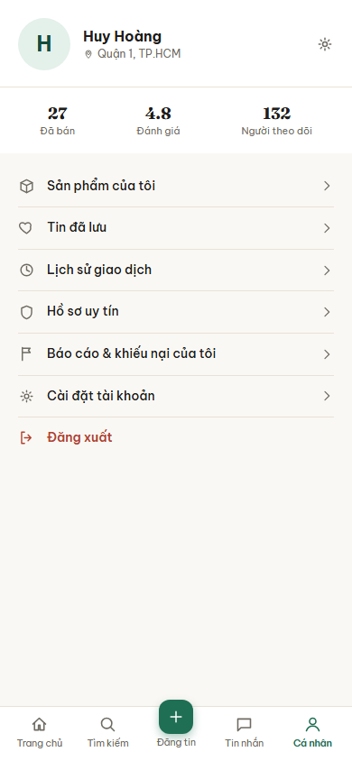
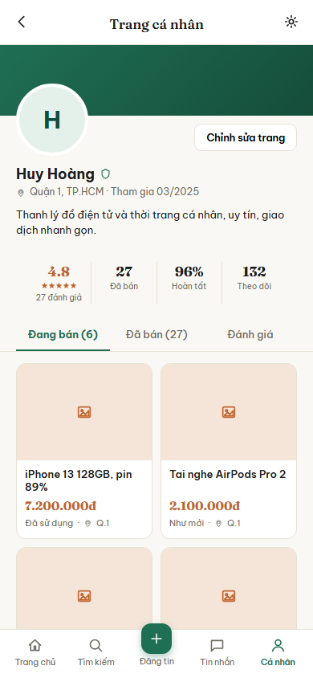
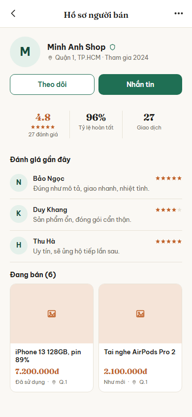
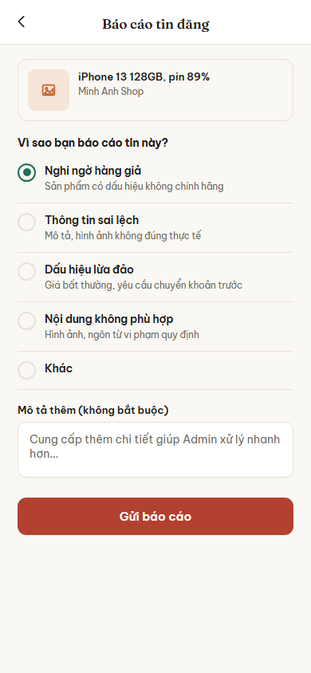
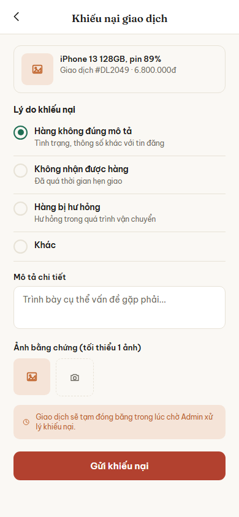
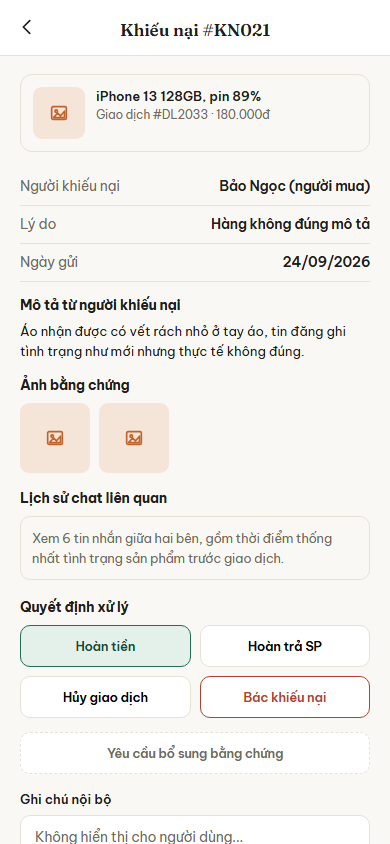

# Nhóm D: Hồ sơ và tin cậy

6 màn hình, nộp theo 3 đợt: đợt 1 một màn (D01), đợt 2 hai màn (D02, D03), đợt 3 ba màn (D04, D05, D06).

## D01. Hồ sơ cá nhân

**Ảnh:** 

**Mục đích:** Trang cá nhân của chính người đang đăng nhập, là lối vào mọi mục quản lý liên quan tới bản thân: hàng đã bán, tin đã lưu, lịch sử giao dịch, uy tín, khiếu nại và cài đặt.

**Thành phần chính:**
- Đầu trang: ảnh đại diện chữ cái đầu, tên người dùng, khu vực (ví dụ Quận 1, TP.HCM), nút cài đặt nhanh ở góc phải
- Hàng ba số liệu: số món đã bán, điểm đánh giá trung bình, số người theo dõi
- Danh sách lối vào, mỗi dòng có biểu tượng và mũi tên sang phải: Sản phẩm của tôi, Tin đã lưu, Lịch sử giao dịch, Hồ sơ uy tín, Báo cáo & khiếu nại của tôi, Cài đặt tài khoản
- Mục "Đăng xuất" màu đỏ, tách riêng ở cuối danh sách
- Thanh điều hướng dưới cùng 5 mục: Trang chủ, Tìm kiếm, Đăng tin (nút tròn nổi ở giữa), Tin nhắn, Cá nhân; mục "Cá nhân" đang được chọn

**Hành động và điều hướng:**
- Bấm "Sản phẩm của tôi": sang B05 Kệ hàng của tôi
- Bấm "Tin đã lưu": sang B06 Tin đã lưu
- Bấm "Lịch sử giao dịch": sang C04 Lịch sử giao dịch
- Bấm "Hồ sơ uy tín": sang D03 Hồ sơ uy tín người bán
- Bấm "Báo cáo & khiếu nại của tôi": sang D05 Tạo khiếu nại
- Bấm "Cài đặt tài khoản": sang A04 Quản lý thông tin cá nhân
- Bấm ảnh đại diện hoặc tên: sang D02 Trang cá nhân
- Bấm "Đăng xuất": hỏi xác nhận, đồng ý thì về A01 Đăng nhập
- Bấm "Trang chủ" ở thanh dưới: sang B01 Trang chủ
- Bấm "Tìm kiếm" ở thanh dưới: sang B02 Tìm kiếm và bộ lọc
- Bấm "Đăng tin" ở thanh dưới: sang B04 Đăng tin
- Bấm "Tin nhắn" ở thanh dưới: sang C01 Danh sách tin nhắn

**Chức năng liên quan:** dòng 4, 5, 6 (chỉnh sửa thông tin, ảnh, địa chỉ), dòng 7 (xem đánh giá cá nhân), dòng 8 (quản lý kệ hàng), dòng 35 (xem danh sách đã lưu), dòng 50 (lịch sử giao dịch), dòng 56, 58 (lịch sử báo cáo, theo dõi khiếu nại) trong bảng đặc tả chức năng.

**Trạng thái đặc biệt:**
- Người dùng chưa bán món nào: ba số liệu hiện 0, mục "Sản phẩm của tôi" gợi ý đăng tin đầu tiên
- Chưa có đánh giá nào: ô điểm đánh giá hiện dấu gạch thay cho số
- Tài khoản chưa xác minh người bán: hiện thêm một dải nhắc gửi yêu cầu xác minh
- Mất mạng: vẫn hiện thông tin đã tải trước đó từ bộ nhớ đệm, kèm dải báo đang xem ngoại tuyến

## D02. Trang cá nhân

**Ảnh:** 

**Mục đích:** Trang công khai của chính người đang đăng nhập, cho họ thấy người khác nhìn hồ sơ của mình ra sao: thông tin giới thiệu, số liệu uy tín và các món đang bán, đã bán, đánh giá nhận được.

**Thành phần chính:**
- Thanh trên: nút quay lại, tiêu đề "Trang cá nhân", nút cài đặt ở góc phải
- Ảnh bìa màu xanh, ảnh đại diện chữ cái đầu đè lên mép ảnh bìa, nút "Chỉnh sửa trang" bên phải
- Tên người dùng kèm biểu tượng khiên, dòng khu vực và ngày tham gia (ví dụ Quận 1, TP.HCM, tham gia 03/2025), đoạn giới thiệu ngắn
- Hàng bốn số liệu: điểm đánh giá kèm năm sao và số lượt đánh giá, số món đã bán, tỉ lệ hoàn tất, số người theo dõi
- Ba tab: "Đang bán (6)", "Đã bán (27)", "Đánh giá"; tab "Đang bán" đang được chọn
- Lưới tin đăng hai cột, mỗi thẻ có ảnh, tên món, giá, tình trạng (Đã sử dụng, Như mới) và khu vực
- Thanh điều hướng dưới cùng 5 mục: Trang chủ, Tìm kiếm, Đăng tin, Tin nhắn, Cá nhân; mục "Cá nhân" đang được chọn

**Hành động và điều hướng:**
- Bấm nút quay lại: về D01 Hồ sơ cá nhân
- Bấm "Chỉnh sửa trang": sang A05 Chỉnh sửa hồ sơ
- Bấm tab "Đang bán", "Đã bán" hoặc "Đánh giá": đổi nội dung bên dưới ngay trên màn này
- Bấm một thẻ tin đăng: sang B03 Chi tiết tin đăng
- Bấm "Trang chủ", "Tìm kiếm", "Đăng tin", "Tin nhắn" ở thanh dưới: sang B01, B02, B04, C01

**Chức năng liên quan:** dòng 6, 7 (chỉnh sửa thông tin và ảnh hồ sơ, qua nút "Chỉnh sửa trang"), dòng 9 (xem đánh giá cá nhân), dòng 10 (kệ hàng: món đang bán, đã bán), dòng 33 (theo dõi, hiện số người theo dõi), dòng 53 (xem lịch sử đánh giá, tab "Đánh giá") trong bảng đặc tả chức năng.

**Trạng thái đặc biệt:**
- Chưa có món đang bán hoặc đã bán: tab tương ứng hiện dòng báo trống thay cho lưới tin đăng
- Chưa có đánh giá nào: ô điểm đánh giá hiện dấu gạch, tab "Đánh giá" hiện dòng báo trống
- Mất mạng: vẫn hiện thông tin và tin đăng đã tải trước đó từ bộ nhớ đệm, kèm dải báo đang xem ngoại tuyến

## D03. Hồ sơ uy tín người bán

**Ảnh:** 

**Mục đích:** Trang người mua xem khi muốn biết một người bán có đáng tin không: số liệu uy tín, đánh giá gần đây của người đã giao dịch, và các món người đó đang bán, kèm nút theo dõi và nhắn tin.

**Thành phần chính:**
- Thanh trên: nút quay lại, tiêu đề "Hồ sơ người bán", nút ba chấm ở góc phải
- Ảnh đại diện chữ cái đầu, tên người bán kèm biểu tượng khiên, dòng khu vực và năm tham gia (ví dụ Quận 1, TP.HCM, tham gia 2024)
- Hai nút: "Theo dõi" (viền) và "Nhắn tin" (nền xanh)
- Hàng ba số liệu: điểm đánh giá kèm năm sao và số lượt đánh giá, tỷ lệ hoàn tất, số giao dịch
- Mục "Đánh giá gần đây": mỗi dòng có ảnh đại diện chữ cái đầu, tên người đánh giá, số sao và lời nhận xét
- Mục "Đang bán (6)": lưới tin đăng hai cột, mỗi thẻ có ảnh, tên món, giá, tình trạng và khu vực

**Hành động và điều hướng:**
- Bấm nút quay lại: về màn trước đó
- Bấm "Theo dõi": theo dõi người bán ngay trên màn này
- Bấm "Nhắn tin": sang C02 Trò chuyện và đề nghị giá với người bán này
- Bấm một thẻ tin đăng: sang B03 Chi tiết tin đăng

**Chức năng liên quan:** dòng 9 (xem công khai điểm đánh giá), dòng 33 (theo dõi người dùng khác), dòng 37 (gửi tin nhắn) trong bảng đặc tả chức năng.

**Trạng thái đặc biệt:**
- Đã theo dõi người bán này: nút "Theo dõi" đổi thành trạng thái đang theo dõi, bấm lại để bỏ theo dõi
- Người bán chưa có đánh giá: mục "Đánh giá gần đây" hiện dòng báo trống, ô điểm hiện dấu gạch
- Người bán không còn món nào đang bán: mục "Đang bán (0)" hiện dòng báo trống
- Mất mạng: vẫn hiện thông tin đã tải trước đó từ bộ nhớ đệm, kèm dải báo đang xem ngoại tuyến

## D04. Báo cáo tin đăng

**Ảnh:** 

**Mục đích:** Cho người dùng báo cáo một tin đăng có dấu hiệu vi phạm, chọn lý do và mô tả thêm để Admin xử lý.

**Thành phần chính:**
- Thanh trên: nút quay lại, tiêu đề "Báo cáo tin đăng"
- Thẻ tin đăng bị báo cáo: ảnh, tên món (ví dụ iPhone 13 128GB, pin 89%) và tên người bán
- Câu hỏi "Vì sao bạn báo cáo tin này?" với năm lựa chọn chọn một, mỗi lựa chọn có dòng giải thích: Nghi ngờ hàng giả, Thông tin sai lệch, Dấu hiệu lừa đảo, Nội dung không phù hợp, Khác
- Ô "Mô tả thêm (không bắt buộc)"
- Nút "Gửi báo cáo" màu đỏ ở cuối

**Hành động và điều hướng:**
- Bấm nút quay lại: về màn trước đó, không gửi báo cáo
- Bấm một lý do: chọn lý do đó, bỏ chọn lý do trước
- Bấm "Gửi báo cáo": gửi báo cáo kèm lý do và mô tả tới Admin

**Chức năng liên quan:** dòng 54 (tạo báo cáo) trong bảng đặc tả chức năng.

**Trạng thái đặc biệt:**
- Chưa chọn lý do nào: nút "Gửi báo cáo" chưa bấm được
- Mất mạng: báo gửi không thành công, giữ nguyên lý do và mô tả đã nhập

## D05. Tạo khiếu nại

**Ảnh:** 

**Mục đích:** Cho người dùng gửi khiếu nại về một giao dịch có vấn đề, kèm lý do, mô tả chi tiết và ảnh bằng chứng để Admin xử lý.

**Thành phần chính:**
- Thanh trên: nút quay lại, tiêu đề "Khiếu nại giao dịch"
- Thẻ giao dịch bị khiếu nại: ảnh, tên món, mã giao dịch và số tiền (ví dụ Giao dịch #DL2049, 6.800.000đ)
- Mục "Lý do khiếu nại" với bốn lựa chọn chọn một, mỗi lựa chọn có dòng giải thích: Hàng không đúng mô tả, Không nhận được hàng, Hàng bị hư hỏng, Khác
- Ô "Mô tả chi tiết"
- Mục "Ảnh bằng chứng (tối thiểu 1 ảnh)": ô ảnh đã thêm và ô có biểu tượng máy ảnh để thêm ảnh
- Dải cảnh báo: giao dịch sẽ tạm đóng băng trong lúc chờ Admin xử lý khiếu nại
- Nút "Gửi khiếu nại" màu đỏ ở cuối

**Hành động và điều hướng:**
- Bấm nút quay lại: về màn trước đó, không gửi khiếu nại
- Bấm một lý do: chọn lý do đó, bỏ chọn lý do trước
- Bấm ô máy ảnh: thêm ảnh bằng chứng
- Bấm "Gửi khiếu nại": gửi khiếu nại tới Admin, giao dịch chuyển sang tạm đóng băng

**Chức năng liên quan:** dòng 57 (tạo đơn khiếu nại, gồm thông tin và bằng chứng) trong bảng đặc tả chức năng.

**Trạng thái đặc biệt:**
- Chưa có ảnh bằng chứng nào: nút "Gửi khiếu nại" chưa bấm được, vì cần tối thiểu 1 ảnh
- Mất mạng: báo gửi không thành công, giữ nguyên lý do, mô tả và ảnh đã chọn

## D06. Admin: Xử lý khiếu nại

**Ảnh:** 

**Mục đích:** Cho Admin xem đầy đủ hồ sơ một khiếu nại và ra quyết định xử lý.

**Thành phần chính:**
- Thanh trên: nút quay lại, tiêu đề là mã khiếu nại (ví dụ Khiếu nại #KN021)
- Thẻ giao dịch liên quan: ảnh, tên món, mã giao dịch và số tiền
- Ba dòng thông tin: người khiếu nại (kèm vai trò, ví dụ người mua), lý do, ngày gửi
- Mục "Mô tả từ người khiếu nại"
- Mục "Ảnh bằng chứng": các ảnh người khiếu nại đã gửi
- Mục "Lịch sử chat liên quan": ô tóm tắt số tin nhắn giữa hai bên
- Mục "Quyết định xử lý": bốn nút Hoàn tiền, Hoàn trả SP, Hủy giao dịch, Bác khiếu nại, và nút "Yêu cầu bổ sung bằng chứng" viền nét đứt
- Ô "Ghi chú nội bộ", không hiển thị cho người dùng

**Hành động và điều hướng:**
- Bấm nút quay lại: về màn trước đó
- Bấm ô "Lịch sử chat liên quan": xem các tin nhắn giữa hai bên
- Bấm một trong bốn nút quyết định: chọn cách xử lý khiếu nại
- Bấm "Yêu cầu bổ sung bằng chứng": yêu cầu người khiếu nại gửi thêm bằng chứng
- Nhập "Ghi chú nội bộ": lưu ghi chú chỉ Admin thấy

**Chức năng liên quan:** dòng 80 (xem chi tiết hồ sơ khiếu nại: lịch sử chat, ảnh bằng chứng, thông tin giao dịch), dòng 81 (ra quyết định xử lý: hoàn tiền, hoàn trả, hủy, bác khiếu nại, yêu cầu bổ sung bằng chứng), dòng 82 (ghi chú nội bộ) trong bảng đặc tả chức năng.

**Trạng thái đặc biệt:**
- Khiếu nại đã có quyết định: các nút quyết định bị khóa, chỉ hiện quyết định đã chọn
- Mất mạng: báo lưu quyết định không thành công, giữ nguyên lựa chọn và ghi chú đã nhập
