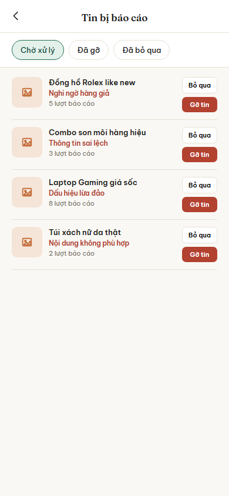
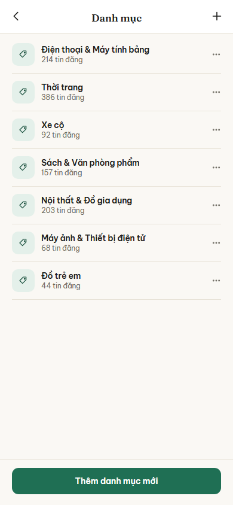
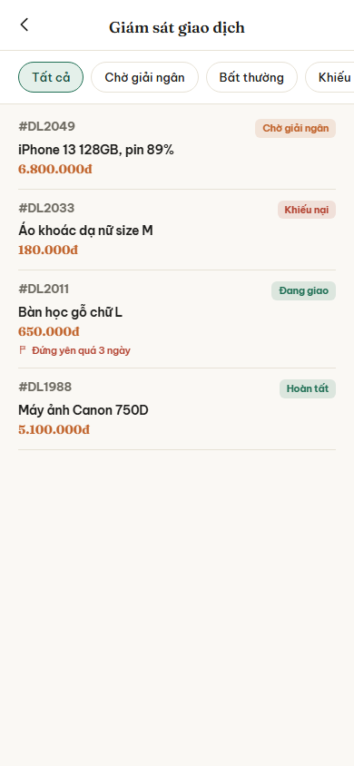

# Nhóm E: Quản trị

6 màn hình, nộp theo 3 đợt: đợt 1 một màn (E01), đợt 2 hai màn (E02, E03), đợt 3 ba màn (E04, E05, E06).

## E01. Admin: Bảng điều khiển

**Ảnh:** chưa nộp

**Mục đích:**

**Thành phần chính:**
-

**Hành động và điều hướng:**
-

**Chức năng liên quan:**

**Trạng thái đặc biệt:**
-

## E02. Admin: Danh sách người dùng

**Ảnh:** chưa nộp

**Mục đích:**

**Thành phần chính:**
-

**Hành động và điều hướng:**
-

**Chức năng liên quan:**

**Trạng thái đặc biệt:**
-

## E03. Admin: Chi tiết người dùng

**Ảnh:** chưa nộp

**Mục đích:**

**Thành phần chính:**
-

**Hành động và điều hướng:**
-

**Chức năng liên quan:**

**Trạng thái đặc biệt:**
-

## E04. Admin: Kiểm duyệt nội dung

**Ảnh:** 

**Mục đích:** Cho admin xem các tin đăng bị người dùng báo cáo và quyết định gỡ tin hay bỏ qua báo cáo.

**Thành phần chính:**
- Tiêu đề "Tin bị báo cáo"
- Ba nút lọc theo trạng thái xử lý: Chờ xử lý, Đã gỡ, Đã bỏ qua
- Danh sách tin bị báo cáo, mỗi dòng có ảnh thu nhỏ, tên tin, lý do báo cáo (màu đỏ), số lượt báo cáo, hai nút "Bỏ qua" và "Gỡ tin"

**Hành động và điều hướng:**
- Bấm "Bỏ qua": tin chuyển sang trạng thái Đã bỏ qua, biến mất khỏi danh sách Chờ xử lý, vẫn ở màn này
- Bấm "Gỡ tin": tin bị ẩn khỏi ứng dụng, chuyển sang trạng thái Đã gỡ, vẫn ở màn này
- Bấm một dòng tin (ngoài hai nút): sang B03 Chi tiết tin đăng để xem đầy đủ trước khi quyết định
- Bấm một nút lọc trạng thái: lọc lại danh sách theo trạng thái đã chọn

**Chức năng liên quan:** dòng 67 (xử lý tin bị báo cáo), dòng 68 (ẩn, gỡ, khôi phục tin), dòng 69 (gỡ hàng loạt tin của tài khoản bị khóa), dòng 70 (lọc từ khóa cấm) trong bảng đặc tả chức năng.

**Trạng thái đặc biệt:**
- Không có tin nào đang chờ xử lý: hiện dòng chữ báo trống
- Tin đã gỡ trước đó: có thể khôi phục lại, nút "Gỡ tin" đổi thành "Khôi phục"
- Mất mạng: hiện lại danh sách đã tải trước đó từ bộ nhớ đệm, kèm dải báo đang xem ngoại tuyến

## E05. Admin: Quản lý danh mục

**Ảnh:** 

**Mục đích:** Cho admin thêm, sửa, xóa danh mục sản phẩm dùng chung cho toàn ứng dụng.

**Thành phần chính:**
- Tiêu đề "Danh mục" và nút "+" ở góc phải để thêm danh mục mới
- Danh sách danh mục, mỗi dòng có biểu tượng nhãn, tên danh mục, số tin đăng thuộc danh mục đó, nút "..." để sửa hoặc xóa
- Nút "Thêm danh mục mới" cố định ở cuối màn hình

**Hành động và điều hướng:**
- Bấm "+" hoặc "Thêm danh mục mới": mở hộp nhập tên danh mục mới, vẫn ở màn này sau khi lưu
- Bấm "...": mở menu Sửa hoặc Xóa cho danh mục đó
- Bấm một danh mục (ngoài nút "..."): mở màn cấu hình thuộc tính tình trạng riêng cho danh mục đó (chưa có mã màn hình riêng, coi như một lớp phủ trên chính màn E05)

**Chức năng liên quan:** dòng 71 (quản lý danh mục và danh mục con), dòng 72 (cấu hình thuộc tính tình trạng theo danh mục) trong bảng đặc tả chức năng.

**Trạng thái đặc biệt:**
- Xóa danh mục đang có tin đăng: hỏi xác nhận, nêu rõ số tin đăng sẽ mất danh mục
- Đặt tên trùng danh mục đã có: báo lỗi ngay dưới ô nhập, không cho lưu

## E06. Admin: Giám sát giao dịch

**Ảnh:** 

**Mục đích:** Cho admin theo dõi tình trạng mọi giao dịch trong hệ thống, phát hiện giao dịch bất thường hoặc đang có khiếu nại.

**Thành phần chính:**
- Tiêu đề "Giám sát giao dịch"
- Hàng lọc theo trạng thái: Tất cả, Chờ giải ngân, Bất thường, Khiếu nại
- Danh sách giao dịch, mỗi dòng có mã giao dịch, tên món đồ, giá, nhãn trạng thái màu, và dòng cảnh báo phụ khi giao dịch đứng yên quá lâu

**Hành động và điều hướng:**
- Bấm một giao dịch: sang C03 Chi tiết giao dịch để xem đầy đủ statusHistory
- Bấm một nút lọc trạng thái: lọc lại danh sách theo trạng thái đã chọn

**Chức năng liên quan:** dòng 73 (theo dõi danh sách giao dịch theo trạng thái), dòng 74 (chi tiết giao dịch kèm statusHistory) trong bảng đặc tả chức năng.

**Trạng thái đặc biệt:**
- Trạng thái "Chờ giải ngân" chỉ hiển thị thông tin, không có nút duyệt tay: giải ngân diễn ra tự động khi người mua xác nhận đã nhận hoặc khi hết thời hạn đếm ngược
- Giao dịch đứng yên quá lâu (ví dụ quá 3 ngày không đổi trạng thái): thêm dòng cảnh báo màu đỏ ngay dưới thông tin giao dịch, chỉ để admin biết, không có hành động can thiệp thủ công ở màn này
- Mất mạng: hiện lại danh sách đã tải trước đó từ bộ nhớ đệm, kèm dải báo đang xem ngoại tuyến
