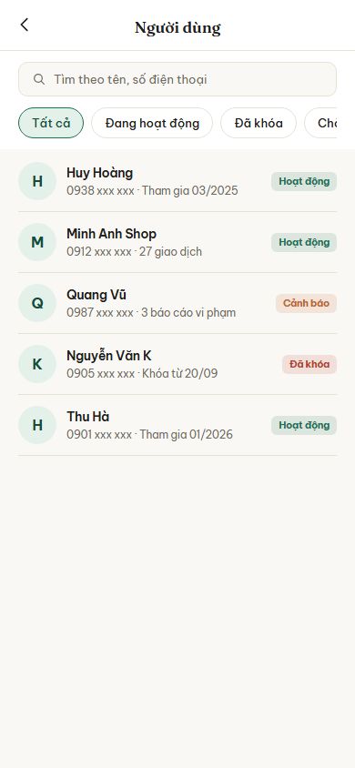
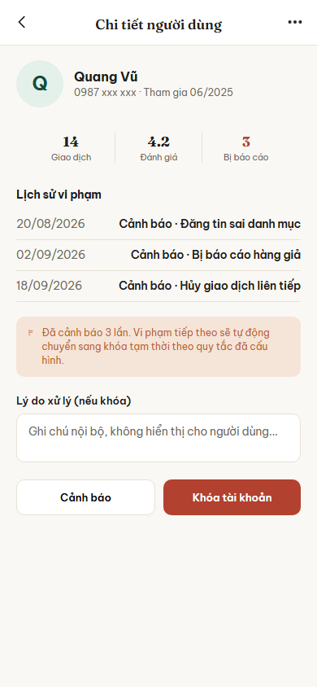

# Nhóm E: Quản trị

6 màn hình, nộp theo 3 đợt: đợt 1 một màn (E01), đợt 2 hai màn (E02, E03), đợt 3 ba màn (E04, E05, E06).

## E01. Admin: Bảng điều khiển

**Ảnh:** chưa nộp

**Mục đích:**

**Thành phần chính:**
-

**Hành động và điều hướng:**
-

**Chức năng liên quan:**

**Trạng thái đặc biệt:**
-

## E02. Admin: Danh sách người dùng

**Ảnh:** 

**Mục đích:** Cho admin xem toàn bộ người dùng của hệ thống, lọc theo trạng thái tài khoản để tìm nhanh người cần xử lý.

**Thành phần chính:**
- Ô tìm kiếm "Tìm theo tên, số điện thoại"
- Hàng lọc theo trạng thái: Tất cả, Đang hoạt động, Đã khóa, Chờ (xác minh)
- Danh sách người dùng, mỗi dòng có ảnh đại diện chữ cái đầu, tên, số điện thoại (che một phần), thông tin phụ (ngày tham gia hoặc số giao dịch), nhãn trạng thái màu theo tình trạng tài khoản

**Hành động và điều hướng:**
- Bấm một người dùng: sang E03 Admin: Chi tiết người dùng
- Gõ vào ô tìm kiếm: lọc danh sách ngay tại màn này, không chuyển màn
- Bấm một nút lọc trạng thái: lọc lại danh sách theo trạng thái đã chọn

**Chức năng liên quan:** dòng 60 (danh sách và lọc người dùng), dòng 62, 63 (khóa, mở khóa tài khoản), dòng 65 (duyệt yêu cầu xác minh người bán) trong bảng đặc tả chức năng.

**Trạng thái đặc biệt:**
- Tìm không ra kết quả: hiện dòng báo không có người dùng nào khớp
- Tài khoản đã khóa: nhãn trạng thái màu đỏ ghi "Đã khóa"
- Tài khoản có báo cáo vi phạm: nhãn trạng thái màu cam ghi "Cảnh báo"
- Mất mạng: hiện lại danh sách đã tải trước đó từ bộ nhớ đệm, kèm dải báo đang xem ngoại tuyến

## E03. Admin: Chi tiết người dùng

**Ảnh:** 

**Mục đích:** Cho admin xem đầy đủ thông tin và lịch sử vi phạm của một người dùng, rồi cảnh báo hoặc khóa tài khoản khi cần.

**Thành phần chính:**
- Đầu trang: ảnh đại diện chữ cái đầu, tên, số điện thoại (che một phần), ngày tham gia
- Ba số liệu: số giao dịch, điểm đánh giá trung bình, số lần bị báo cáo
- Danh sách "Lịch sử vi phạm": mỗi dòng có ngày, loại xử lý (cảnh báo) và lý do
- Dải cảnh báo màu cam khi đã cảnh báo đủ số lần, nêu rõ quy tắc tự động khóa nếu vi phạm tiếp
- Ô nhập "Lý do xử lý (nếu khóa)", chỉ admin thấy, không hiện cho người dùng
- Hai nút cuối trang: "Cảnh báo" (nút phụ) và "Khóa tài khoản" (nút chính, màu đỏ)

**Hành động và điều hướng:**
- Bấm nút "quay lại" ở đầu trang: về E02 Admin: Danh sách người dùng
- Bấm "Cảnh báo": ghi thêm một dòng vào lịch sử vi phạm với bậc cảnh báo tăng dần, vẫn ở màn này
- Bấm "Khóa tài khoản": yêu cầu nhập lý do trước, sau đó khóa tài khoản, vẫn ở màn này với trạng thái cập nhật

**Chức năng liên quan:** dòng 61 (xem hồ sơ người dùng), dòng 62, 63 (khóa, mở khóa tài khoản), dòng 64 (cảnh báo theo bậc), dòng 66 (nhật ký hoạt động) trong bảng đặc tả chức năng.

**Trạng thái đặc biệt:**
- Cảnh báo lần 1: chỉ cảnh báo, tài khoản vẫn hoạt động bình thường
- Cảnh báo lần 2: tự động khóa tạm theo quy tắc ba bậc, nút "Khóa tài khoản" đổi thành "Mở khóa tạm"
- Cảnh báo lần 3: khóa vĩnh viễn, không còn nút mở khóa
- Tài khoản đã khóa từ trước: nút chính đổi thành "Mở khóa tài khoản"

## E04. Admin: Kiểm duyệt nội dung

**Ảnh:** chưa nộp

**Mục đích:**

**Thành phần chính:**
-

**Hành động và điều hướng:**
-

**Chức năng liên quan:**

**Trạng thái đặc biệt:**
-

## E05. Admin: Quản lý danh mục

**Ảnh:** chưa nộp

**Mục đích:**

**Thành phần chính:**
-

**Hành động và điều hướng:**
-

**Chức năng liên quan:**

**Trạng thái đặc biệt:**
-

## E06. Admin: Giám sát giao dịch

**Ảnh:** chưa nộp

**Mục đích:**

**Thành phần chính:**
-

**Hành động và điều hướng:**
-

**Chức năng liên quan:**

**Trạng thái đặc biệt:**
-
