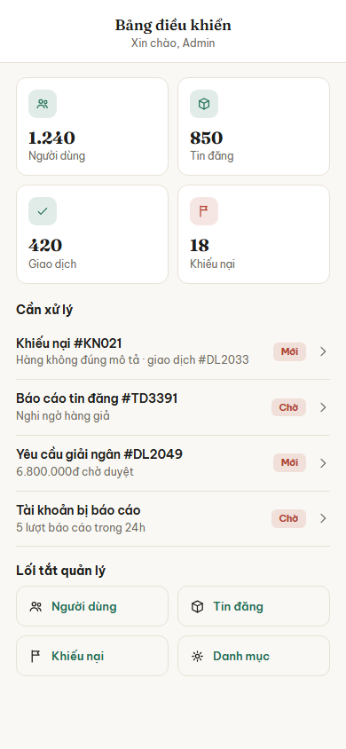

# Nhóm E: Quản trị

6 màn hình, nộp theo 3 đợt: đợt 1 một màn (E01), đợt 2 hai màn (E02, E03), đợt 3 ba màn (E04, E05, E06).

## E01. Admin: Bảng điều khiển

**Ảnh:** 

**Mục đích:** Màn hình đầu tiên admin thấy sau khi đăng nhập, cho biết nhanh quy mô hệ thống và những việc đang chờ xử lý, rồi dẫn sang các mục quản trị chi tiết.

**Thành phần chính:**
- Tiêu đề "Bảng điều khiển" và dòng chào "Xin chào, Admin"
- 4 ô đếm dạng thẻ: tổng số người dùng, tổng số tin đăng, tổng số giao dịch, tổng số khiếu nại
- Danh sách "Cần xử lý": mỗi dòng là một việc cụ thể (khiếu nại mới, tin bị báo cáo, yêu cầu liên quan tới giao dịch, tài khoản bị báo cáo), kèm nhãn trạng thái "Mới" hoặc "Chờ" và mũi tên điều hướng
- Lưới "Lối tắt quản lý" 4 nút: Người dùng, Tin đăng, Khiếu nại, Danh mục

**Hành động và điều hướng:**
- Bấm một dòng trong "Cần xử lý": sang màn chi tiết tương ứng để xem và xử lý (khiếu nại sang E04, báo cáo tin sang E04, việc liên quan giao dịch sang E06); đây chỉ là lối tắt xem nhanh, không có nút duyệt ngay tại đây
- Bấm nút "Người dùng": sang E02 Admin: Danh sách người dùng
- Bấm nút "Tin đăng": sang E04 Admin: Kiểm duyệt nội dung
- Bấm nút "Khiếu nại": sang E04 Admin: Kiểm duyệt nội dung
- Bấm nút "Danh mục": sang E05 Admin: Quản lý danh mục

**Chức năng liên quan:** dòng 60 (danh sách và lọc người dùng), dòng 67 (xử lý tin bị báo cáo), dòng 79 (danh sách khiếu nại) trong bảng đặc tả chức năng. 4 ô đếm chỉ là số liệu tổng hiển thị tĩnh, không phải chức năng thống kê nâng cao ở dòng 84 đến 88 (vẫn ngoài phạm vi).

**Trạng thái đặc biệt:**
- Không có việc nào cần xử lý: ẩn khối "Cần xử lý", chỉ còn 4 ô đếm và lối tắt
- Mất mạng: hiện số liệu đã tải trước đó từ bộ nhớ đệm, kèm dải báo đang xem ngoại tuyến
- "Yêu cầu giải ngân" trong danh sách chỉ mang tính hiển thị trạng thái (đã tự động giải ngân theo mốc đếm ngược ở E06), không có nút duyệt tay ở đây hay ở E06

## E02. Admin: Danh sách người dùng

**Ảnh:** chưa nộp

**Mục đích:**

**Thành phần chính:**
-

**Hành động và điều hướng:**
-

**Chức năng liên quan:**

**Trạng thái đặc biệt:**
-

## E03. Admin: Chi tiết người dùng

**Ảnh:** chưa nộp

**Mục đích:**

**Thành phần chính:**
-

**Hành động và điều hướng:**
-

**Chức năng liên quan:**

**Trạng thái đặc biệt:**
-

## E04. Admin: Kiểm duyệt nội dung

**Ảnh:** chưa nộp

**Mục đích:**

**Thành phần chính:**
-

**Hành động và điều hướng:**
-

**Chức năng liên quan:**

**Trạng thái đặc biệt:**
-

## E05. Admin: Quản lý danh mục

**Ảnh:** chưa nộp

**Mục đích:**

**Thành phần chính:**
-

**Hành động và điều hướng:**
-

**Chức năng liên quan:**

**Trạng thái đặc biệt:**
-

## E06. Admin: Giám sát giao dịch

**Ảnh:** chưa nộp

**Mục đích:**

**Thành phần chính:**
-

**Hành động và điều hướng:**
-

**Chức năng liên quan:**

**Trạng thái đặc biệt:**
-
